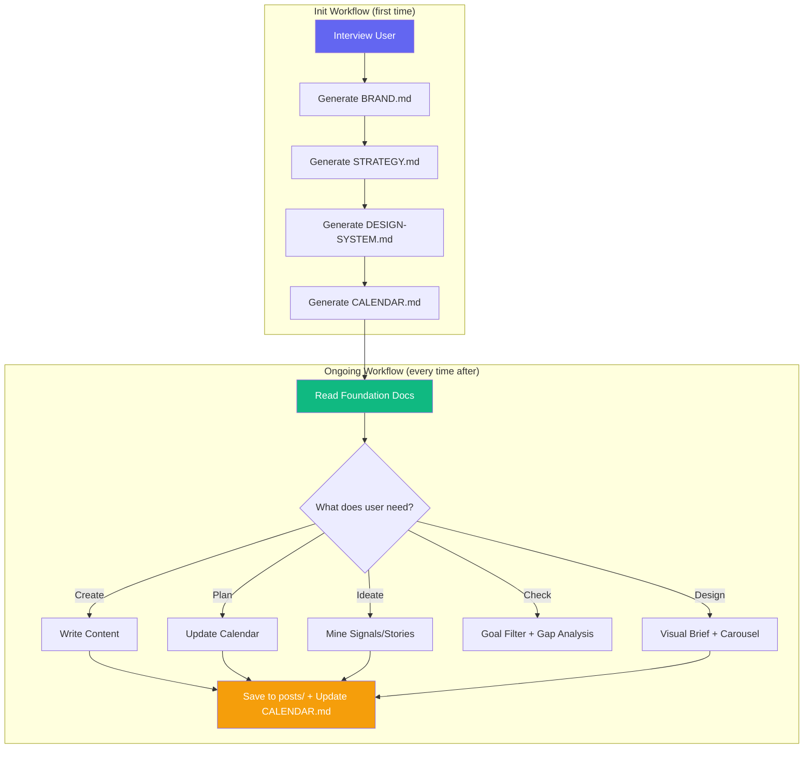

<div align="center">

# 🚀 lz-content-engine

**Unified Social Media Content Creation & Design Engine**

[](https://skills.sh)
[](https://opensource.org/licenses/MIT)
[](https://github.com/lutfi-zain/lz-stacks)

</div>

---

## Overview

A persistent, multi-agent content system that lives inside your project. Unlike one-shot content generators, `lz-content-engine` builds a **foundation first** (brand identity, strategy, design system) then generates content that compounds — every post looks like the same brand, serves the same goal, and fits into a series architecture.

Two sub-domains in one skill:
- **Content Creation** — copywriting, captions, hooks, threads, scripts, newsletters, lead magnets
- **Content Design** — visual identity, carousel system, design tokens, brand consistency

## How it Works



## What's Inside

### 14 References (loaded on demand)

| Reference | Source | What it contains |
|---|---|---|
| `thirty-day-system.md` | 30-Day Playbook | The complete 5-level system: Focus → Style → Plan → Create → Package |
| `the-bridge-method.md` | The Bridge skill | Climax-led openings — the foundational hook technique |
| `carousel-design-system.md` | Carousel System | 3-rule visual system: Color → Fonts → Layout |
| `series-planning.md` | Series Planner | 1 topic → multi-part series with binge loops |
| `signal-mining.md` | Signal Mine | Raw trends/news → niche-relevant content ideas |
| `follow-up-strategy.md` | Follow-Up Engine | Winning post → 5 compound follow-up angles |
| `audience-gap-analysis.md` | Audience Gaps | Surface silent audience questions before publishing |
| `story-mining.md` | Story Mine | Personal experience → 5 content angle types |
| `lead-magnet-guide.md` | Freebie Suggester | Graded lead magnet ideation with ManyChat integration |
| `linkedin-playbook.md` | New research | LinkedIn algorithm, specs, engagement patterns |
| `twitter-playbook.md` | New research | Twitter/X algorithm, threads, reply strategy |
| `instagram-playbook.md` | New research | Instagram algorithm, carousels, Reels, ManyChat |
| `copywriting-psychology.md` | New research | AIDA, PAS, BAB, hooks, cognitive biases, power words |
| `design-specs.md` | New research | Platform dimensions, color psychology, typography |

### 13 Assets (actionable templates)

| Asset | Purpose |
|---|---|
| `brand-template.md` | BRAND.md — identity, voice, values, audience |
| `strategy-template.md` | STRATEGY.md — goal, pillars, series, KPIs |
| `calendar-template.md` | CALENDAR.md — pipeline with status tracking |
| `design-system-template.md` | DESIGN-SYSTEM.md — visual rules and tokens |
| `caption-cta-guide.md` | Platform-specific caption + CTA routing rules |
| `reel-script-template.md` | Short-form script with beats + visual cues |
| `newsletter-template.md` | Newsletter draft structure |
| `post-linkedin.md` | LinkedIn post template |
| `post-twitter-thread.md` | Twitter/X thread template |
| `post-instagram.md` | Instagram post template |
| `visual-brief-template.md` | Structured brief for visual asset creation |
| `repurposing-matrix.md` | 1 idea → multi-platform adaptation matrix |
| `hashtag-strategy.md` | Per-platform hashtag research template |

## Absorbed Skills

This engine consolidates 11 individual skills + 2 playbook systems:

| Original | → Became |
|---|---|
| The Bridge | `references/the-bridge-method.md` |
| Goal Lock | Baked into SKILL.md init workflow |
| Series Planner | `references/series-planning.md` |
| Signal Mine | `references/signal-mining.md` |
| Follow-Up Engine | `references/follow-up-strategy.md` |
| Audience Gaps | `references/audience-gap-analysis.md` |
| Story Mine | `references/story-mining.md` |
| Caption & CTA | `assets/caption-cta-guide.md` |
| Reel Scripter | `assets/reel-script-template.md` |
| Newsletter Drafter | `assets/newsletter-template.md` |
| Freebie Suggester | `references/lead-magnet-guide.md` |
| 30-Day Playbook | `references/thirty-day-system.md` |
| Carousel System | `references/carousel-design-system.md` |

## Integrations

| Skill | How it integrates |
|---|---|
| `lz-humanizer-pro` | Generated content passes through AI text humanizer before publishing |
| `lz-session-learn` | Brand voice learnings persist across sessions |
| `lz-youtube-engine` | Video content can be repurposed into social posts |

## The Research

| Source | What we used |
|---|---|
| Grow With Alex — 30-Day System | 5-level content creation framework (Focus → Package) |
| Grow With Alex — Carousel System | 3-rule visual design system (Color → Fonts → Layout) |
| The Bridge Method | Climax-led openings that replace manufactured hooks |
| LinkedIn Creator Mode Research | Algorithm signals: dwell time, engagement velocity, SSI |
| Twitter/X Algorithm Documentation | Bookmark signal, reply weighting, thread distribution |
| Instagram Algorithm Research | Save/share weighting, carousel completion rate, Reels boost |
| Cialdini — Influence (1984) | Persuasion principles adapted for social content CTAs |
| Kahneman — Thinking Fast and Slow (2011) | Cognitive biases applied to hook psychology |
| ManyChat Documentation | DM keyword automation for Instagram lead capture |

## Install

```bash
npx skills add lutfi-zain/lz-stacks --skill lz-content-engine
```

## Quick Start

```bash
# In any project, trigger init:
/lz-content-engine init

# Or start creating content directly:
/lz-content-engine write linkedin post about [topic]

# Check goal alignment:
/lz-content-engine goal-check [idea]
```
