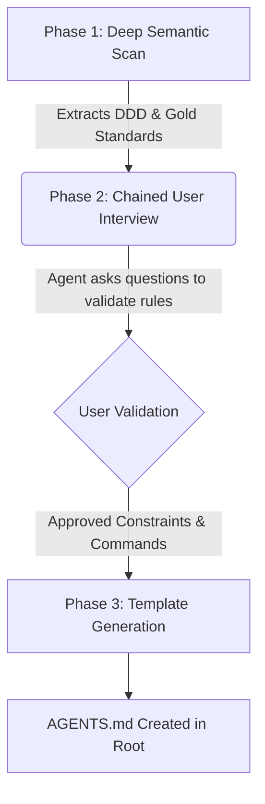

<div align="center">
  <h1>lz-create-agentsmd</h1>
  <p><strong>Agentic Context Engineering: Enterprise-Grade <code>AGENTS.md</code> Generation</strong></p>
  
  [](https://skills.sh/lutfi-zain/lz-create-agentsmd)
  [](https://skills.sh)
  [](#the-research-msr-2026)
</div>

---

## 🌟 Overview

`lz-create-agentsmd` is a highly advanced, interactive workflow skill designed for AI coding agents (Claude, Cursor, Antigravity, etc.). 

While basic skills generate simple `AGENTS.md` templates with tech-stack lists and PR guidelines, this skill utilizes **AST/LSP Semantic Scanning** to deeply analyze your repository's architecture and extract the Domain-Driven Design (DDD) "Ubiquitous Language". 

It then conducts a **chained user interview** to validate findings before generating a Full-Lifecycle `AGENTS.md` file that actively overrides lazy AI behaviors.

## 🚀 How it Works

When an agent executes this skill, it follows a strict 3-phase workflow:



## 🧠 The Research (MSR 2026 Context Engineering)

This skill is built upon the findings of the 2026 MSR research on **Agentic AI Context**. The research identified that simply feeding an AI a list of technologies causes "Context Rot" and hallucinations. 

To prevent this, `lz-create-agentsmd` enforces:

1. **Negative Constraints:** Instructs the AI on what *not* to do (e.g., "Never use raw SQL").
2. **Progressive Disclosure:** Instead of hardcoding code snippets into the `AGENTS.md` (which become outdated), the skill forces the agent to identify and link to **"Gold Standard"** files inside the repo.
3. **Domain-Driven Design (DDD):** Enforces a strict "Ubiquitous Language" to prevent agents from inventing random variable names.
4. **Dynamic Learnings Log:** Initializes a dedicated section for logging recurring AI failure modes over time.

## 📦 Installation

To install this skill globally across all your projects via the `skills.sh` registry:

```bash
npx skills add lutfizain/lz-create-agentsmd -g
```

## 🛠️ Usage

Simply tell your AI agent:

> *"Run the `lz-create-agentsmd` skill to analyze this repository and set up my AGENTS.md file."*

The agent will take it from there!

## 🛡️ Security & Auditing

`lz-create-agentsmd` is built with a focus on security. It does not install arbitrary external dependencies or execute obfuscated binaries. The skill exclusively utilizes your agent's native tools (semantic file reading and interactive user prompts), ensuring it easily complies with the `skills.sh` continuous security auditing requirements.

---
<div align="center">
  <i>Built for the modern AI engineering ecosystem.</i>
</div>

