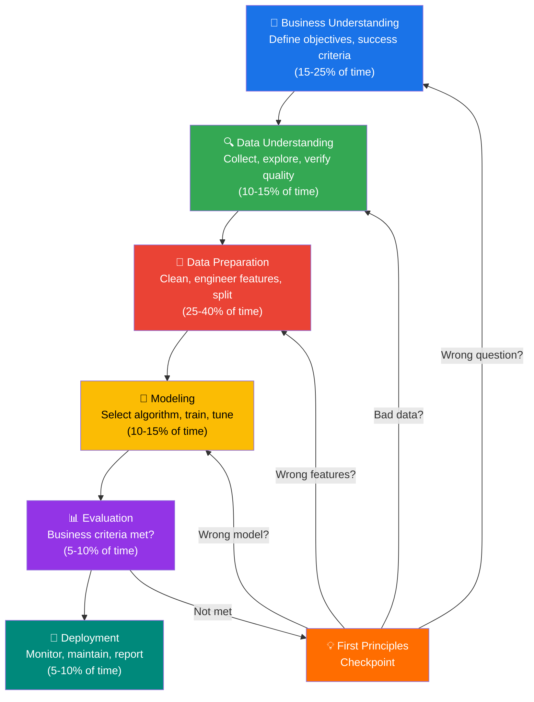

<div align="center">

# `lz-data-science-core`

### *Ask the right question. Then model it.*

**Strategic data science workflow for AI agents.**
**From business problem framing through CRISP-DM to stakeholder impact.**

[](https://agentskills.io/specification)
[](./SKILL.md)
[](https://python.org)
[](https://skills.sh)
[](https://github.com/anthropics/claude-code)
[](https://github.com/earendil-works/pi)

`EDA` · `CRISP-DM` · `A/B Testing` · `Feature Engineering` · `Model Evaluation` · `Stakeholder Communication`

</div>

---

## Why this skill exists

Most data science projects don't fail because the model is bad — they fail because the wrong question was asked, the data was misunderstood, or the results were never translated into action. This skill codifies the mindset and workflow of a senior data scientist who has shipped models at scale and knows that **80% of the value comes from asking the right question**.

> *"The goal is not to build a model. The goal is to make a better decision."*

`lz-data-science-core` gives AI agents a complete playbook: business problem framing with first-principles thinking, the full CRISP-DM cycle with actionable checklists, production EDA patterns, rigorous experiment design, and stakeholder communication templates that translate "AUC improved by 0.13" into "$1.2M saved annually."

---

## Quick Install

```bash
# Global
npx skills add lutfi-zain/lz-stacks --skill lz-data-science-core -g

# Per-project
npx skills add lutfi-zain/lz-stacks --skill lz-data-science-core
```

Or copy the `skills/lz-data-science-core/` folder into your project's `skills/` directory.

---

## How it Works

The skill guides agents through the CRISP-DM cycle — the industry standard for data mining and machine learning projects — enhanced with first-principles checkpoints at every phase transition.



At each phase transition, the agent runs a **first-principles checkpoint** (Rafferty, 2025): *"What decision are we informing? Does this metric capture the value we care about?"* — preventing the most common failure mode of data science projects: solving the wrong problem well.

---

## What's Inside

| Component | Contents |
| --- | --- |
| **SKILL.md** | Full workflow: persona, CRISP-DM phases with checklists, algorithm selection matrix, feature engineering patterns, model evaluation protocol, stakeholder communication, 8 anti-patterns |
| **references/eda-patterns.md** | Production Python code for profiling, distributions, correlations, missing data analysis, outlier detection, time-series EDA |
| **references/experiment-design.md** | A/B testing protocol, multi-armed bandits, causal inference, power analysis, multiple testing correction |
| **references/communication.md** | Executive summary template, technical report template, dashboard design, visualization selection guide, storytelling framework |
| **scripts/data-audit.py** | Executable data quality audit — run on any CSV for instant profiling, missing value analysis, outlier flags, and cardinality report |

---

## Skill Architecture

```
lz-data-science-core/
├── SKILL.md                         # Main workflow + CRISP-DM framework
├── README.md                        # This file
├── references/
│   ├── eda-patterns.md              # Production EDA code patterns (Python)
│   ├── experiment-design.md         # A/B tests, MAB, causal inference
│   └── communication.md            # Stakeholder templates & visualization
└── scripts/
    └── data-audit.py               # CLI data quality audit tool
```

Progressive disclosure: only `SKILL.md` is loaded at activation. References and scripts are loaded on demand.

---

## Usage

### Exploratory Data Analysis
> *"Analyze this dataset — I want to understand distributions, missing patterns, and key correlations before we model."*

### ML Pipeline
> *"Build a churn prediction model for our SaaS customers. We have 18 months of usage data."*

### Experiment Design
> *"Design an A/B test to measure the impact of our new onboarding flow on 7-day retention."*

### Data Audit
```bash
python scripts/data-audit.py customer_data.csv
python scripts/data-audit.py sales.csv --json audit_report.json
```

### Stakeholder Report
> *"Translate these model results into an executive summary for the VP of Product."*

---

## The Research

This skill synthesizes seven independent sources spanning the full data science lifecycle:

| Source | Year | Contribution | How this skill uses it |
| --- | --- | --- | --- |
| **[CRISP-DM 2.0](https://www.datascience-pm.com/crisp-dm-2/)** | 2000/2024 | Industry-standard 6-phase process model for data mining | Core framework — all 6 phases with actionable checklists |
| **[Rafferty — First Principles Thinking](https://towardsdatascience.com/first-principles-thinking-for-data-scientists/)** | 2025 | First-principles as a complement to frameworks; the 3-question test | First-principles checkpoints at every CRISP-DM phase transition |
| **[Grootendorst — Truths about DS](https://www.maartengrootendorst.com/)** | 2024 | Honest accounting of time allocation (80% cleaning) and failure modes | The 80% Data Cleaning Reality section; Anti-Patterns |
| **[HEART Framework](https://research.google/pubs/measuring-the-user-experience-on-a-large-scale-user-centered-metrics-for-web-applications/)** (Google, CHI 2010) | 2010 | Happiness, Engagement, Adoption, Retention, Task success metrics | Metric selection in Business Understanding phase |
| **[Kohavi — Trustworthy Experiments](https://experimentguide.com/)** | 2020 | Gold standard for online controlled experiments | Experiment design patterns, sample size calculation, pitfall catalog |
| **[Tufte — Visual Display](https://www.edwardtufte.com/book/the-visual-display-of-quantitative-information/)** | 2001 | Data-ink ratio, chart junk, lie factor | Visualization best practices in Communication Protocol |
| **[Knaflic — Storytelling with Data](https://www.storytellingwithdata.com/)** | 2015 | Context → What → So-What → Now-What narrative structure | Stakeholder communication templates |
| **[Agent Skills Spec v1](https://agentskills.io/specification)** | 2024 | Portable skill format for AI agents | SKILL.md structure, frontmatter, progressive disclosure |

---

## Compatibility

| Agent | Support | Notes |
| --- | --- | --- |
| **Claude Code** | ✅ Full | Native — works with subagents, bash tools |
| **Pi** | ✅ Full | Same `SKILL.md` frontmatter, same tool surface |
| **OpenAI Codex** | ✅ Full | Spec-compliant |
| **Cursor / Windsurf** | ⚠️ Partial | `SKILL.md` is read; script execution may vary |
| **Generic agents** | ✅ | Any agent implementing the [Agent Skills spec](https://agentskills.io) |

---

## See Also

- [`lz-session-learn`](./../lz-session-learn/SKILL.md) — Persist learnings from data science sessions into project memory
- [`lz-create-agentsmd`](./../lz-create-agentsmd/SKILL.md) — Generate an `AGENTS.md` for your DS project
- [Agent Skills Specification](https://agentskills.io/specification) — The open format this skill implements

---

<div align="center">
  <i>Built by <a href="https://github.com/lutfi-zain">Lutfi Zain</a>.</i><br>
  <i>Because the goal is not to build a model — it's to make a better decision.</i>
</div>
