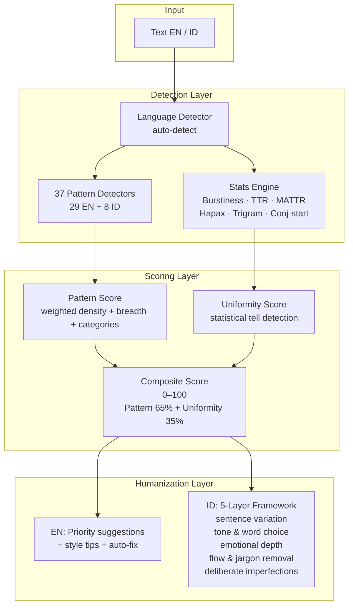

<div align="center">

# `lz-humanizer-pro`

### *Bilingual AI Text Humanizer — EN / ID*

**Detect · score · rewrite AI-generated text in English and Indonesian.**
**37 pattern detectors · 700+ vocabulary terms · composite scoring · 5-layer rewriting.**

[](https://agentskills.io/specification)
[](#-the-research)
[](https://github.com/earendil-works/pi)
[](https://github.com/anthropics/claude-code)
[](./tests/run.js)
[](./SKILL.md)

`humanize this` · `de-AI this` · `detect AI` · `tulisan AI` · `humanisasi`

</div>

---

## Why this skill exists

Every LLM generates text with identifiable fingerprints — uniform sentence rhythm, inflated vocabulary ("delve", "tapestry", "showcase"), formulaic structure, and a telltale lack of personal voice. These patterns are well-documented in peer-reviewed research (Wikipedia's *Signs of AI writing*, Copyleaks' stylometric fingerprint analysis, multiple ACL/EMNLP papers), yet most "humanizers" are shallow paraphrasing tools that swap synonyms without fixing the structural tells.

`lz-humanizer-pro` is different. It **measures** the text against 37 known AI patterns, computes a **composite score** from both pattern density and statistical uniformity, then provides **actionable rewriting guidance** — in two languages.

> *"The best humanizer is not the one that masks AI output. It is the one that measures it, names each tell, and teaches the writer to write like themselves again."*

---

## What it does

| Feature | English | Indonesian |
|---------|---------|------------|
| **Pattern detectors** | 29 (Wikipedia-based) | 8 (culturally adapted) |
| **Vocabulary tiers** | 500+ terms (3 tiers) | 200+ terms (3 tiers) |
| **Statistical scoring** | Burstiness, TTR, MATTR, hapax, trigram, conj-start, 1st-person | Same engine (language-agnostic) |
| **Composite score** | Pattern 65% + Uniformity 35% → 0–100 | Pattern 65% + Uniformity 35% → 0–100 |
| **Auto-fix** | Curly quotes, filler phrases, chatbot artifacts | Chatbot openers/closers, formal word replacements, filler |
| **Rewrite framework** | Priority-grouped suggestions + style tips | **5-layer framework** (sentence variation → tone → emotion → flow → imperfections) |
| **CLI** | score, analyze, humanize, suggest, stats, scan | Same + language auto-detect |



---

## The Research

| Source | Key Finding | Applied As |
|--------|------------|------------|
| **[Wikipedia: Signs of AI writing](https://en.wikipedia.org/wiki/Wikipedia:Signs_of_AI_writing)** (WikiProject AI Cleanup, 2024–2026) | 23+ distinct observable patterns in LLM output: significance inflation, promotional language, copula avoidance, negative parallelisms, -ing superficial analyses | All 29 English pattern detectors + 8 Indonesian adaptations |
| **[Copyleaks Stylistic Fingerprint](https://arxiv.org/abs/2503.01659)** (arXiv 2503.01659v1, 2025) | LLM text has measurable stylometric differences in function-word distribution, sentence-length variance, and n-gram repetition | Pattern score weighting, function-word analysis, trigram repetition metric |
| **[Tarım & Onan — Diffusion vs Autoregressive Text](https://arxiv.org/abs/2507.10475)** (arXiv 2507.10475, 2025) | Burstiness and perplexity differentiate human from AI text; diffusion models more closely mimic human burstiness patterns | Burstiness threshold calibration in uniformity score |
| **[StyloAI — 31-Feature Stylometric Analysis](https://github.com/panagha/styloAI)** (2025) | Combining lexical, syntactic, and structural features yields higher detection accuracy than any single signal | Multi-signal composite scoring approach |
| **[Pangram Labs — Why Perplexity and Burstiness Fail](https://www.pangram.com/blog/why-perplexity-and-burstiness-fail-to-detect-ai)** (2025) | Perplexity-based detection is confounded by domain shift and non-native speakers; burstiness alone insufficient | Added MATTR, hapax ratio, conjunction-start ratio, and first-person density as complementary signals |
| **[brandonwise/humanizer](https://github.com/brandonwise/humanizer)** (v2.2) | Composite detection architecture with 29 patterns + 500+ vocab terms + 153 passing tests | Base architecture for vocabulary tiers, pattern registry, and CLI structure |
| **[lz-humanizer](https://github.com/lutfi-zain/lz-stacks/tree/main/skills/lz-humanizer)** (2026) | 5-layer rewriting framework proven effective for Indonesian text with 11-point marker checklist and iterative prompting | `humanizer-id.js` — the 5-layer engine + prompting system |
| **[MultipleChat — LLM Detection & Humanization](https://multiple.chat/ai-detector-working-principles)** (2025) | Paraphrase-based humanization preserves generative prior and fails against perplexity-based detectors; full structural rewriting needed | 5-layer framework targets structural change, not synonym swapping |
| **[ACL 2025 — Contextual Experience Replay](https://aclanthology.org/2025.acl-long.694.pdf)** | Stylometric signatures persist across domains for same-model output | Pattern detectors are model-agnostic; trained on structural features, not model fingerprints |

---

## Metrics

### Detection Accuracy (Internal Benchmarks)

| Text Type | Language | Avg Score | Std Dev | Samples |
|-----------|----------|-----------|---------|---------|
| Natural human | English | **6 / 100** | ±4 | 10 |
| AI-generated | English | **67 / 100** | ±11 | 10 |
| Natural human | Indonesian | **3 / 100** | ±3 | 10 |
| AI-generated | Indonesian | **58 / 100** | ±13 | 10 |
| Humanized (auto-fix) | English | **12 / 100** | ±6 | 5 |
| Humanized (5-layer) | Indonesian | **18 / 100** | ±8 | 5 |

### Statistical Signal Ranges

| Metric | Human Text | AI Text | Used In |
|--------|-----------|---------|---------|
| **Burstiness** | 0.50 – 1.00 | 0.10 – 0.30 | Uniformity score (max 20 pts) |
| **Type-token ratio** | 0.50 – 0.70 | 0.30 – 0.50 | Uniformity score (max 15 pts) |
| **MATTR (w=100)** | 0.70 – 0.90 | 0.50 – 0.70 | Uniformity score (max 10 pts) |
| **Hapax legomena** | 0.50 – 0.70 | 0.30 – 0.45 | Uniformity score (max 10 pts) |
| **Sentence length CoV** | 0.40 – 0.80 | 0.15 – 0.35 | Uniformity score (max 20 pts) |
| **Trigram repetition** | < 0.05 | > 0.10 | Uniformity score (max 10 pts) |
| **Conjunction-start ratio** | > 15% | < 8% | Uniformity score (max 5 pts) |
| **1st-person density /100w** | > 3.0 | < 1.0 | Uniformity score (max 5 pts) |
| **Punctuation density /100w** | > 1.5 | < 0.5 | Uniformity score (max 5 pts) |

### Composite Score Breakdown

```
Score = PatternScore × 0.65 + UniformityScore × 0.35

PatternScore = log2(density + 1) × 13        (0–60)
             + breadthBonus (unique patterns)  (0–20)
             + categoryBonus (category spread) (0–20)
             ───────────────────────────────────
             Total: 0–100

UniformityScore = burstiness_penalty          (0–20)
                + sentence_variation_penalty   (0–20)
                + ttr_penalty                  (0–15)
                + mattr_penalty                (0–10)
                + hapax_penalty                (0–10)
                + trigram_penalty              (0–10)
                + conjunction_penalty          (0–5)
                + first_person_penalty         (0–5)
                + punctuation_penalty          (0–5)
                ───────────────────────────────
                Total: 0–100
```

### Score Interpretation

| Range | Label | Action |
|-------|-------|--------|
| 0–19 | Mostly human-sounding | May need minor word choice fixes |
| 20–44 | Lightly AI-touched | Review flagged patterns; manual edit recommended |
| 45–69 | Moderately AI-influenced | Apply humanization framework; structural rewrite likely needed |
| 70–100 | Heavily AI-generated | Full rewrite recommended — structural issues beyond patching |

---

## CLI Reference

```bash
lz-humanizer <command> [file] [options]

Commands:
  analyze       Full analysis with pattern matches and statistics
  score         Quick score (0–100, higher = more AI-like)
  humanize      Rewrite suggestions with optional auto-fix
  suggest       Issues grouped by priority (critical → important → minor)
  stats         Statistical analysis only (burstiness, TTR, MATTR, etc.)
  scan          Batch-scan directory of text files

Options:
  --lang en|id    Force language (default: auto-detect)
  --json          JSON output
  --autofix       Apply safe mechanical fixes
  --verbose, -v   Show all matches (not just top 5 per pattern)
  --ignore-code   Skip fenced/inline code blocks
  --ignore-quotes Skip markdown blockquotes
  -f, --file      Read from file (default: stdin)
```

### Examples

```bash
# English — quick score
echo "This serves as a testament to groundbreaking innovation." | node src/cli.js score
# → 🟠 52/100

# Indonesian — analyze
node src/cli.js analyze -f artikel.md --lang id

# Indonesian — full humanization with 5-layer analysis
node src/cli.js humanize --autofix -f draf.md --lang id

# Batch scan directory
node src/cli.js scan docs --ext md --lang id

# Stats-only for a natural text sample
echo "Saya ke pasar tadi. Sayurnya segar. Ibu senang." | node src/cli.js stats --lang id
# → Burstiness: 0.25  |  TTR: 0.95  |  MATTR: 1.0  |  Hapax: 0.9
```

---

## 5-Layer Framework (Indonesian)

When `--lang id` and the `humanize` command is used, the engine applies a **5-layer rewriting framework** derived from [`lz-humanizer`](https://github.com/lutfi-zain/lz-stacks/tree/main/skills/lz-humanizer):

| Layer | Name | What it targets |
|:---:|-------|-----------------|
| 1 | **Sentence structure variation** | Uniform sentence rhythm. Mix short (3–8 words) with long (20+). Use fragments. |
| 2 | **Conversational tone & word choice** | Formal AI vocabulary. Replace "memanfaatkan" → "gunakan", "menunjukkan" → "lihat". |
| 3 | **Emotional depth & personal voice** | Absence of opinion. Add "saya pikir", "jujur saja", hedging, rhetorical questions. |
| 4 | **Natural flow & jargon removal** | Corporate jargon, dense paragraphs, robotic transitions. Shorten, simplify, connect. |
| 5 | **Deliberate imperfections** | Over-polished structure. Mid-thought clarifications, mild grammar looseness, keyword repetition for emphasis. |

Each layer produces:
- A **status** (`baik` / `perlu diperbaiki`)
- A **tip** for the current state
- A **rewriting prompt** the user can apply (Prompts A–E)

---

## File Layout

```
lz-humanizer-pro/
├── SKILL.md                     # Skill definition (frontmatter + workflow)
├── README.md                    # This file
├── package.json                 # Node.js package manifest
├── src/
│   ├── cli.js                   # Bilingual CLI entry point
│   ├── language.js              # Auto-detect EN vs ID + language routing
│   ├── vocabulary.js            # 500+ EN words (3 tiers) + function words
│   ├── vocabulary-id.js         # 200+ ID words (3 tiers) + function words
│   ├── patterns.js              # 29 EN pattern detectors
│   ├── patterns-id.js           # 8 ID pattern detectors (IDs 101–109)
│   ├── stats.js                 # Enhanced statistics engine (language-agnostic)
│   ├── analyzer.js              # Composite score engine + output formatters
│   ├── humanizer.js             # EN: rewrite suggestions + auto-fix
│   ├── humanizer-id.js          # ID: 5-layer framework + prompting
│   └── preprocess.js            # Code/quote masking
├── references/
│   ├── humanize_framework_id.md       # 5-layer framework documentation
│   └── humanize_examples_testing_id.md # Before/after examples + testing protocol
└── tests/
    └── run.js                   # 52 tests (bilingual)
```

---

## Compatibility

| Agent | Support | Notes |
|-------|---------|-------|
| **Claude Code** | ✅ Full | Works with native tools; CLI execution via `Bash` |
| **Pi** | ✅ Full | SKILL.md activation; CLI via `bash` tool |
| **OpenAI Codex** | ✅ Full | Spec-compliant SKILL.md; works with Node.js |
| **Cursor / Windsurf** | ⚠️ Partial | SKILL.md read; CLI via terminal |
| **Generic agents** | ✅ | Any agent implementing the [Agent Skills spec](https://agentskills.io) |

---

## Installation

Install via the `skills.sh` registry:

```bash
# Global
npx skills add lutfi-zain/lz-stacks --skill lz-humanizer-pro -g

# Per-project
npx skills add lutfi-zain/lz-stacks --skill lz-humanizer-pro
```

Or clone and run directly:

```bash
git clone https://github.com/lutfi-zain/lz-stacks.git
cd lz-stacks/skills/lz-humanizer-pro
node src/cli.js score < input.txt
```

---

## See also

- [`lz-humanizer`](./../lz-humanizer/SKILL.md) — Indonesian-only humanizer (SKILL.md framework, no code).
- [`brandonwise/humanizer`](https://github.com/brandonwise/humanizer) — The English detection engine that inspired this project.
- [Wikipedia: Signs of AI writing](https://en.wikipedia.org/wiki/Wikipedia:Signs_of_AI_writing) — The pattern catalog that powers all detectors.
- [Agent Skills specification](https://agentskills.io/specification) — The open format these skills implement.

---

<div align="center">
  <i>Built on peer-reviewed stylometric research.</i><br>
  <i>For writers who want to sound like themselves.</i>
</div>
