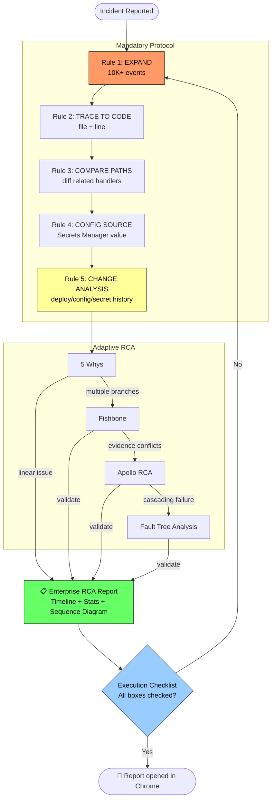

# lz-kairos-debugger

[](https://agentskills.io/specification)
[](../../LICENSE)
[](#the-research)

> Enterprise-grade AWS ECS/CloudWatch root-cause investigation skill. Fuses adaptive RCA methodology, digital forensics, change analysis, and architectural tracing to debug cross-service Kairos (HIS/PAS/PAY) failures.

## Why This Skill?

Most debugging skills stop at "check the logs." Real production incidents in microservices architectures require **cross-service forensics, code tracing, config verification, and evidence-based RCA** — not assumptions.

`lz-kairos-debugger` enforces **11 mandatory investigation rules** derived from real incident analysis, preventing the most common agent failures:

- **Never conclude from small samples** — aggregate 10K+ events first
- **Trace every error to code** — file + line number, not just "token expired"
- **Compare related code paths** — `/login` vs `/login-integration` may differ
- **Verify config values** — read Secrets Manager actual values, never assume
- **Never label as BUG** without architectural context confirmation
- **Never make absolute claims** — always qualify search scope

## How it Works



## The Research

This skill is built on 40+ sources from exhaustive research across:

| Domain | Sources | Key Findings |
|--------|---------|--------------|
| **RCA Methodologies** | Apollo RCA, PRIZ 5+ Whys, FMEA, FTA | Adaptive escalation from 5-Whys → Fishbone → Apollo based on complexity |
| **AWS ECS/CloudWatch** | AWS Docs, re:Post, Container Insights | `filter-log-events` fallback when Insights blocked, EventBridge capture, OTel migration |
| **SRE Postmortem** | Google SRE Book, incident.io | Blameless language, automated timeline construction, MTTx metrics |
| **Change Analysis** | resolve.ai, Splunk, Datadog | Temporal scoring heuristic, before/after comparison methodology |
| **Cloud DFIR** | CrowdStrike, Sysdig, AWS Prescriptive Guidance | Container forensics, evidence preservation, 6-phase DFIR process |
| **AI-Powered RCA** | AWS Bedrock samples, BMW case study | LangGraph + HITL pattern, 85% accuracy in automated root cause identification |

## Installation

```bash
npx skills add lutfi-zain/lz-stacks --skill lz-kairos-debugger -g
```

## Usage

### Investigate a production incident

```
/lz-kairos-debugger

Tolong investigasi error 500 di /api/v6/get-users-hope/list 
sejak jam 07:00 WIB tadi di Kairos production.
```

### Create an RCA report

```
/lz-kairos-debugger

Buat laporan RCA lengkap untuk incident Keycloak token expiry 
yang terjadi hari ini. Sertakan timeline, statistik per user, 
dan sequence diagram.
```

## Investigation Rules (11 Mandatory)

| # | Rule | Why |
|---|------|-----|
| 1 | **Expand Before Conclude** — min 10K events | Prevents premature root cause claims |
| 2 | **Trace to CODE** — file + line number | "Token expired" is not root cause |
| 3 | **Compare Related Code Paths** — diff handlers | `/login` ≠ `/login-integration` |
| 4 | **Trace Config to SOURCE** — read actual Secrets Manager value | Never assume env/config defaults |
| 5 | **Change Analysis MANDATORY** — git, ECS, ECR, SM, CloudTrail | Most incidents correlate with changes |
| 6 | **Never Say "Not Found"** — list all sources checked | Transparency prevents re-investigation |
| 7 | **Never Label as BUG** — frame as observation | Architectural decisions exist |
| 8 | **Check Staging + Production** — compare configs | Staging may reveal config drift |
| 9 | **Never Use Absolute Claims** — qualify search scope | "Tidak dipakai" impacts management |
| 10 | **Verify Active Version** — check middleware/guard | `getMeV4` may or may not be current |
| 11 | **Include GitHub Line Links** — in every report | Enables verification and follow-up |

## Kairos-Specific Gotchas

- **HIS containers** (`his-*-iac`) lack SSM agent — `execute-command` fails
- **Secrets Manager** loads config at runtime — never assume code defaults
- **CNDS signature mismatch** — common leading zero issue (`0E78...` vs `E78...`)
- **Login vs Login-Integration** — different `is_um`, different token expiry behavior
- **Secrets Manager unit typos** — `"year"` vs `"years"` causes silent fallback

## Report Output

The skill produces a structured RCA report with:

- **Executive Summary** — 2-5 sentences, lead with root cause
- **Impact Assessment** — users affected, duration, SLA breach
- **Forensic Timeline** — second-by-second reconstruction from all sources
- **Change Analysis** — deploy/config/secret changes in investigation window
- **Root Cause Chain** — 5-Whys / Apollo / Fishbone with evidence at each step
- **Sequence Diagram** — Mermaid visualization of failure flow
- **Statistics** — per-user, per-endpoint, per-client error breakdown
- **Action Items** — owners, deadlines, Jira tickets
- **GitHub Line Links** — every code reference linked to source

## References

- `SKILL.md` — Main skill with 11 mandatory rules
- `references/rca-methodologies.md` — Complete RCA method comparison
- `references/change-analysis.md` — Deploy-correlated incident analysis
- `references/sre-postmortem.md` — Blameless postmortem and timeline
- `references/investigation-playbook.md` — AWS ECS/CloudWatch patterns
- `assets/rca-template.md` — Enterprise RCA report template

## License

MIT
