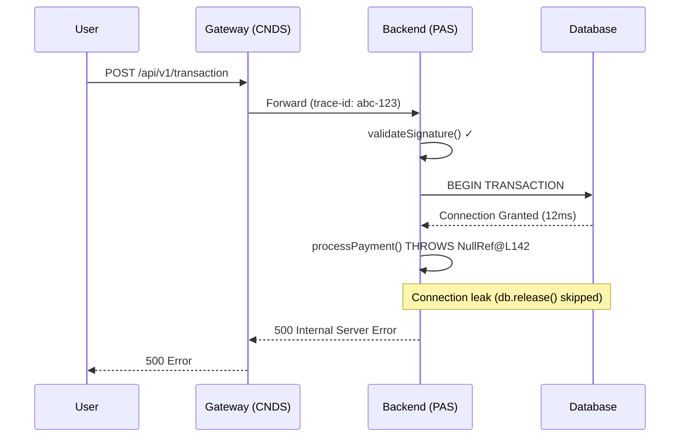

# LZ Kairos Debugger

Investigation, troubleshooting, and root-cause analysis (RCA) skill for AWS ECS microservices architecture, focused on Kairos ecosystem (HIS, PAS, PAY, CNDS).

## When to Use

- Investigating production bugs, error endpoints, or DB transaction spikes
- Anomalous system behavior in AWS ECS services
- Cross-service failures spanning FE → Gateway → Backend → DB
- Creating incident RCA reports with evidence chains
- Building investigation timelines and statistics
- Generating sequence diagrams from traces

## Methodology (Adaptive RCA — Mandatory Sequential)

### Phase 1: Digital Forensics (Evidence First, Assumptions Last)

**CRITICAL RULE: NEVER touch/edit code before investigation completes.**

1. Extract raw logs from CloudWatch using `aws logs filter-log-events` (fallback when Insights blocked by IAM)
2. Aggregate stats via client-side Python scripts from raw CloudWatch JSON output
3. Capture system state: ECS task definitions, Secrets Manager values, service health
4. Check CloudWatch Investigations (AI-powered) for auto-generated hypotheses

```bash
# Primary extraction pattern
aws logs filter-log-events \
  --log-group-name "/ecs/<cluster-name>" \
  --filter-pattern '{ $.level = "ERROR" }' \
  --start-time <epoch_ms> --end-time <epoch_ms> \
  --interleaved --max-items 1000 \
  --profile <profile> --region ap-southeast-3
```

### Phase 2: Change Analysis (Parallel Track)

**Always run alongside Phase 1.** Most production incidents correlate with recent changes.

1. Identify what changed in the last 24-72h: deploys, config edits, DB migrations, feature flags, library updates
2. Join deploy timestamps with error rate inflection points
3. Compare system state BEFORE vs AFTER the suspected change
4. If timing correlation is strong → Change Analysis may be the fastest path to root cause

See `references/change-analysis.md` for detailed methodology.

### Phase 3: Adaptive RCA (Escalate Based on Complexity)

Start with **5 Whys**. Escalate when complexity demands:

```
5 Whys (linear issues)
    ↓ multiple branches emerge
Fishbone (brainstorm categories)
    ↓ evidence conflicts or multi-factor
Apollo RCA (evidence-based cause-effect mapping)
    ↓ safety-critical or cascading failure
Fault Tree Analysis (boolean logic gates)
```

**When to escalate rules:**

- Multiple equally plausible "why" branches → Fishbone
- Can't validate each "why" with objective evidence → Apollo RCA
- Problem spans multiple teams/services with interrelated causes → FTA
- High business/risk impact requiring formal rigor → Full Apollo with RealityCharting

See `references/rca-methodologies.md` for complete method comparison.

### Phase 4: Cross-Service Architectural Tracing

1. Find unique request ID from entry-point logs (Gateway/CNDS)
2. Trace same request ID downstream: FE → Gateway → Middleware → Backend ECS → DB
3. Check `Secrets Manager` for runtime config (NEVER assume code defaults or Task Definition env vars)
4. Correlate X-Ray/OTel traces if available, or manually reconstruct from CloudWatch logs per service

### Phase 5: Timeline & Statistics Construction

Reconstruct incident timeline second-by-second using:

- CloudWatch log timestamps across all affected services
- ECS lifecycle events (task state changes, deployments)
- CloudTrail API calls
- Error rate metrics (aggregated from Phase 1 Python analysis)

See `references/sre-postmortem.md` for timeline best practices.

### Phase 6: Visual Sequence Generation

Generate Mermaid diagrams from investigation trace:



For trace waterfall visualization, use Mermaid Gantt with `dateFormat: x`:

```mermaid
gantt
    title Trace Waterfall (request abc-123)
    dateFormat x
    axisFormat %S.%3L
    section Gateway
        Parse Request    :0, 15
    section Backend
        Validate Auth    :15, 45
        processPayment   :45, 200
    section Database
        Execute Query    :47, 190
```



## Kairos-Specific Gotchas

- **HIS containers** (`his-*-iac`) lack SSM agent — `execute-command` fails with `TargetNotConnectedException`. Use CloudWatch logs only.
- **Secrets Manager** loads config at runtime via `SecretStorage.syncSecret()`. Never assume pool sizes, timeouts, or credentials from source code defaults.
- **CNDS signature validation**: Check `Console.WriteLine(signature)` in C# CloudWatch logs. Common mismatch: leading zero (e.g., `0E78...` vs `E78...`).
- **UAT vs Local Proxy**: They route to different backends. Test both when debugging signature/integration issues.

## References

- `references/rca-methodologies.md` — Complete RCA method comparison and selection guide
- `references/change-analysis.md` — Change Analysis methodology for deploy-correlated incidents
- `references/sre-postmortem.md` — SRE blameless postmortem and timeline construction
- `references/investigation-playbook.md` — AWS ECS/CloudWatch technical patterns
- `assets/rca-template.md` — Enterprise RCA report template

## Execution

When user requests investigation: collect logs → run Change Analysis in parallel → build adaptive RCA chain → construct timeline → generate sequence diagram → produce RCA report using `assets/rca-template.md`.
