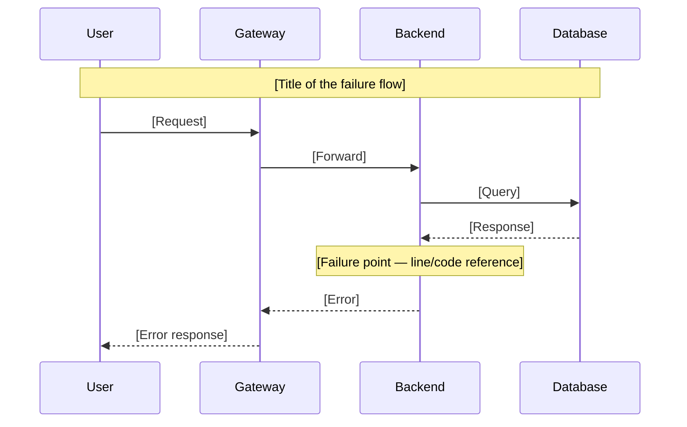

# Incident Root Cause Analysis (RCA) Report

## Metadata

| Field | Value |
|-------|-------|
| **Incident ID** | INC-YYYY-XXXX |
| **Date** | YYYY-MM-DD |
| **Severity** | P1 / P2 / P3 / P4 |
| **Duration** | [HH:MM] total |
| **Services Affected** | [list services] |
| **Incident Commander** | [name] |
| **RCA Author** | [name] |
| **Status** | Draft / In Review / Final |

## Blameless Postmortem Notice

This document follows blameless postmortem principles. We focus on:

- What happened (not who caused it)
- Why our systems allowed this to happen
- How we can prevent similar incidents

Names appear only to establish timeline context, not to assign blame.

---

## 1. Executive Summary

[2-5 sentences: what happened, impact, duration, resolution. Lead with the answer.]

**Root Cause:** [One sentence summary of the root cause]

**Impact:** [Quantified: users affected, revenue impact, SLA breach]

**Resolution:** [How it was mitigated/resolved]

---

## 2. Impact Assessment

| Metric | Value |
|--------|-------|
| Users affected | [count or %] |
| Duration of impact | [HH:MM] |
| Revenue impact | [amount or "none measured"] |
| SLA breach | [Yes/No — which SLA] |
| Data loss | [Yes/No — describe] |
| Downstream services affected | [list] |

---

## 3. Forensic Timeline

### Pre-Incident Context

| Timestamp | Event | Evidence Source |
|-----------|-------|----------------|
| [YYYY-MM-DD HH:MM:SS] | [e.g., deploy of X v2.1.0] | [CI/CD pipeline] |
| [YYYY-MM-DD HH:MM:SS] | [e.g., DB migration] | [Migration log] |

### Detection

| Timestamp | Event | Evidence Source |
|-----------|-------|----------------|
| [HH:MM:SS] | First alert fires | [CloudWatch alarm] |
| [HH:MM:SS] | On-call acknowledged | [PagerDuty/Slack] |
| [HH:MM:SS] | Incident declared, IC assigned | [Slack #incident] |

### Investigation

| Timestamp | Event | Evidence Source |
|-----------|-------|----------------|
| [HH:MM:SS] | Identified affected service | [CloudWatch Logs] |
| [HH:MM:SS] | Found error pattern | [Log analysis] |
| [HH:MM:SS] | Cross-service trace completed | [Trace reconstruction] |

### Mitigation

| Timestamp | Event | Evidence Source |
|-----------|-------|----------------|
| [HH:MM:SS] | Decision: [rollback/fix-forward/flag] | [Slack #incident] |
| [HH:MM:SS] | Mitigation applied | [Deploy pipeline] |
| [HH:MM:SS] | Error rate returned to baseline | [CloudWatch metrics] |

### Recovery

| Timestamp | Event | Evidence Source |
|-----------|-------|----------------|
| [HH:MM:SS] | Verified all users recovered | [Monitoring] |
| [HH:MM:SS] | Incident resolved | [Slack #incident] |

---

## 4. Change Analysis

### Changes in Investigation Window (72h before symptom onset)

| Change Type | What Changed | When | Suspected? |
|-------------|-------------|------|:----------:|
| Code deploy | [service version] | [timestamp] | ✅/❌ |
| Config change | [parameter] | [timestamp] | ✅/❌ |
| Secrets rotation | [secret name] | [timestamp] | ✅/❌ |
| DB migration | [migration ID] | [timestamp] | ✅/❌ |
| Feature flag | [flag name] | [timestamp] | ✅/❌ |
| Traffic pattern | [description] | [timestamp] | ✅/❌ |

### Before vs After Comparison

| Metric | Before | After | Delta |
|--------|--------|-------|-------|
| Error rate | [%] | [%] | [%] |
| P99 latency | [ms] | [ms] | [ms] |
| DB connections | [n/max] | [n/max] | [description] |
| CPU | [%] | [%] | [%] |

### Causality Verdict

[Strong / Weak / Coincidental — with evidence for the verdict]

---

## 5. Root Cause Analysis

### Method Used

[5 Whys / Fishbone / Apollo RCA / Change Analysis / FTA]

### RCA Chain

**Why #1 (Symptom):** [What was observed?]

- *Evidence:* `[log snippet, metric, or config]`

**Why #2:** [Why did #1 happen?]

- *Evidence:* `[log snippet, metric, or config]`

**Why #3:** [Why did #2 happen?]

- *Evidence:* `[log snippet, metric, or config]`

**Why #N (Root Cause):** [What is the fundamental cause?]

- *Evidence:* `[log snippet, metric, or config]`

### Root Cause Statement

[Clear, specific statement of the root cause. Not a symptom, not a contributing factor — the fundamental reason the system produced this failure.]

---

## 6. Architectural Trace (Sequence Diagram)

### Trace Waterfall

```mermaid
gantt
    title Trace Waterfall
    dateFormat x
    axisFormat %S.%3L
    section Gateway
        Parse Request    :0, 15
    section Backend
        Validate Auth    :15, 45
        [Failed Operation] :crit, 45, 200
    section Database
        Execute Query    :47, 190
```

---

## 7. What Went Well

- [Positive action 1]
- [Positive action 2]
- [Where we got lucky]

---

## 8. What Went Poorly

- [Gap 1: detection, automation, runbook, tooling]
- [Gap 2]
- [Gap 3]

---

## 9. Action Items

| # | Action | Owner | Due Date | Status | Jira Ticket |
|---|--------|-------|----------|--------|-------------|
| 1 | [Specific, measurable action] | [name] | [date] | Open | [TICKET-123] |
| 2 | [Specific, measurable action] | [name] | [date] | Open | [TICKET-456] |
| 3 | [Specific, measurable action] | [name] | [date] | Open | [TICKET-789] |

---

## 10. Lessons Learned

### Generalizable Insights

1. [Insight 1: what we learned about our system]
2. [Insight 2: what we learned about our process]
3. [Insight 3: what we learned about our tooling]

### Detection Improvements

- [What alerting was missing?]
- [What monitoring should be added?]

### Prevention Improvements

- [What test would have caught this?]
- [What guardrail should exist?]

---

## Appendix

### A. Raw Log Samples

[Relevant log excerpts with timestamps]

### B. Metrics Charts

[Screenshots or descriptions of key metrics during incident]

### C. Related Incidents

[Links to similar past incidents, if any]

---

**Reviewers:** [names]
**Review Date:** [date]
**Next Postmortem Review:** [date — typically 2-4 weeks after action items due]
