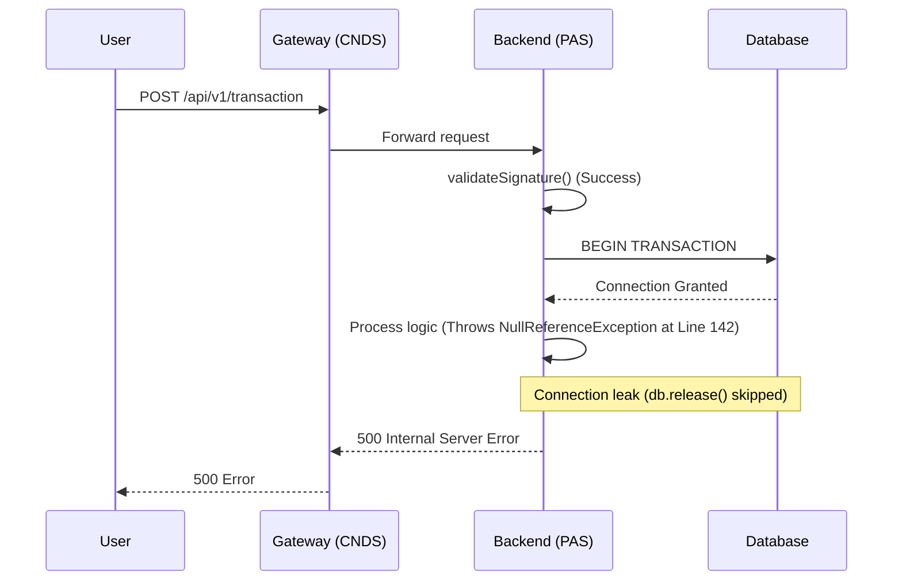

# Incident Root Cause Analysis (RCA)

**Date of Investigation:** [YYYY-MM-DD]
**Incident Name/Ticket:** [Incident Title]
**Services Involved:** [e.g., HIS Frontend, CNDS Gateway, PAS Backend]

---

## 1. Executive Summary

[1-2 paragraf ringkasan jelas tentang apa yang terjadi, dampak ke bisnis/user, dan apa akar masalah utamanya tanpa jargon terlalu dalam]

## 2. Forensic Timeline & Statistics

[Rekonstruksi chronological kejadian berbasis log. Lampirkan rate error, count, spike traffic, atau metric relevan hasil ekstraksi Python/CloudWatch]

- **[HH:MM:SS]** - [Event 1] (Data point: X errors/min)
- **[HH:MM:SS]** - [Event 2]
- **[HH:MM:SS]** - [Event 3]

## 3. Deep "5-Whys" Chain (The Interrogation)

[Rantai sebab-akibat berurutan dari simptom terluar hingga root cause terdalam, buktikan dengan snippet log di setiap step jika memungkinkan]

- **Why #1 (Symptom):** [Endpoint Timeout]
  - *Evidence:* `[Log snippet/Metric]`
- **Why #2:** [Database Connection Pool Exhausted]
  - *Evidence:* `[Log snippet/Metric]`
- **Why #3:** [Unclosed connections during Signature validation failure]
  - *Evidence:* `[Log snippet/Metric]`
- **Why #N (Root Cause):** [...]

## 4. Architectural Sequence (The Trace)

[Mermaid sequence diagram menunjukkan flow kegagalan hingga line-of-code atau komponen kritis]

## 5. Required Actions (Remediation)

[Action items konkret. JANGAN BERIKAN EDIT/PATCH CODE kecuali diminta spesifik. Berikan rekomendasi arsitektural/logika]

- [ ] Fix 1
- [ ] Fix 2
- [ ] Monitor metric X selama 48 jam
