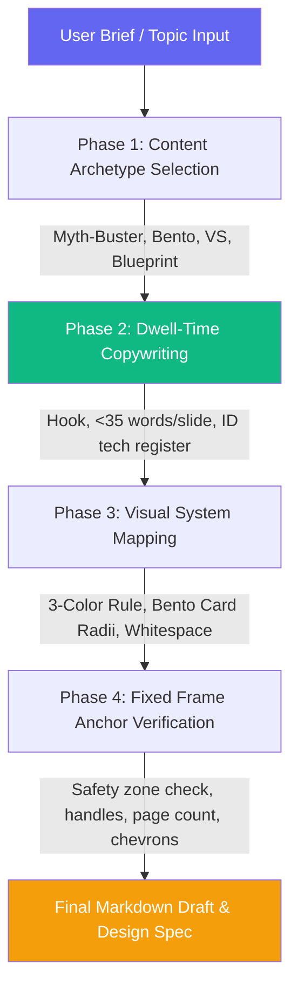

<div align="center">

# ⚡ lz-linkedin-carousel

**High-Engagement B2B LinkedIn PDF Carousel Architect**

[](https://skills.sh)
[](https://opensource.org/licenses/MIT)
[](https://github.com/lutfi-zain/lz-stacks)

</div>

---

## Overview

`lz-linkedin-carousel` is a specialized engineering-to-social creation pipeline. It helps developers, founders, and content creators design premium B2B LinkedIn PDF carousels matching the visual style of Notion, Stripe, and Elastic.

Rather than generic templates, it applies research-backed layout systems (Bento grids, 3-color constraints) and psychological copywriting archetypes optimized for **feed dwell-time** and high-intent **Saves**.

---

## How it Works



---

## What's Inside

### References

| Reference | Purpose |
|---|---|
| [`carousel-frameworks.md`](./references/carousel-frameworks.md) | Details the science of dwell-time, copywriting archetypes, Stripe/Notion visual DNA, typography constraints, and safe coordinate zones. |

### Assets

| Asset | Purpose |
|---|---|
| [`carousel-cheatsheet.md`](./assets/carousel-cheatsheet.md) | Actionable pre-flight checklist verifying copywriting rules, design layout anchors, and style compliance. |

---

## The Research

| Source | Concept Applied |
|---|---|
| **Richard van der Blom (2024-2026)** | LinkedIn Algorithm research: median 6.6%-7.0% document engagement, 278% increase in reach compared to text-only, and 6-10 slide swiping threshold. |
| **Nielsen Norman Group (NNg)** | Mobile reading pattern research: F-shaped scan patterns, mobile safety margins (80px padding), and the necessity of high-contrast layout grids. |
| **Stripe / Notion Brand Systems** | Bento-box compartmentalization, line-art minimalism, and strict 3-color visual hierarchies for B2B readability. |

---

## Install

Install globally or into your current project:

```bash
npx skills add lutfi-zain/lz-stacks --skill lz-linkedin-carousel
```

---

## Quick Start

Trigger the architect inside your agent chat:

```bash
/skill:lz-linkedin-carousel write a carousel about [topic]
```
