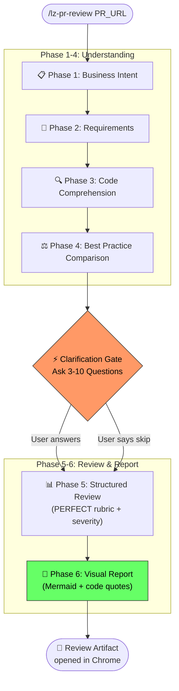

# lz-pr-review

[](https://agentskills.io/specification)
[](../../LICENSE)
[](#the-research)

> Six-phase pull request review that goes beyond syntax: understands business intent, validates requirements, analyzes code changes, compares against best practices, asks clarifying questions, then delivers a visual review with mermaid diagrams, quoted code, and actionable suggestions.

## Why Another PR Review Skill?

Most PR review skills do one thing: read the diff and dump a list of findings. That's table stakes. Real reviews require **understanding WHY the change exists** before evaluating HOW it was implemented.

`lz-pr-review` enforces a structured workflow that mirrors how a Staff-level engineer reviews code:

1. First understand the **business context**
2. Then validate against **requirements**
3. Then comprehend the **actual code changes**
4. Then compare against **best practices**
5. **Ask clarifying questions** (the step most automated tools skip)
6. Only then deliver the **review** — with visuals, quotes, and next steps

## How it Works



## Installation

```bash
npx skills add lutfi-zain/lz-stacks --skill lz-pr-review -g
```

## Usage

```
# Review a PR by URL
/lz-pr-review https://github.com/org/repo/pull/123

# Review a PR by number (within a repo)
/lz-pr-review #123

# Review with explicit requirements
/lz-pr-review #123
Requirements:
1. Must handle empty cart case
2. Discount should cap at 50%
3. API response should include pagination metadata
```

## What's Included

```
lz-pr-review/
├── SKILL.md                            # Main workflow (6 phases)
├── README.md                           # This file
├── references/
│   ├── review-checklist.md             # Security, Performance, Reliability, Tests
│   ├── anti-patterns.md                # 8 review anti-patterns to avoid
│   └── severity-guide.md              # Severity classification decision tree
├── scripts/
│   ├── pr-fetch.sh                     # Fetch all PR data in one pass
│   └── pr-submit-review.sh            # Submit review verdict to GitHub
└── assets/
    ├── REVIEW_REPORT.md                # Report template with mermaid diagrams
    └── CLARIFICATION_QUESTIONS.md     # Question bank by category + PR size
```

## The PERFECT Rubric

Every review evaluates code against 7 dimensions, in priority order:

| Dimension | Focus | Source |
|-----------|-------|--------|
| **P**erformance | N+1 queries, unbounded ops, memory | Sentry engineering practices |
| **E**dge Cases | Null handling, boundaries, race conditions | Google Engineering Practices |
| **R**eliability | Backwards compat, rollback safety, feature flags | Factory-AI review rubric |
| **F**orm | Naming, complexity, DRY, separation of concerns | PERFECT framework |
| **E**vidence | Test coverage, edge case tests, behavior verification | Bacchelli & Bird (ICSE 2013) |
| **C**orrectness | Logic errors, type safety, concurrency | Sadowski et al. (ICSE 2018) |
| **T**aste | Architecture fit, design patterns, tech debt | Rigby & Bird (FSE 2013) |

## Severity Classification

| Emoji | Level | Definition | Action |
|-------|-------|-----------|--------|
| 🔴 | BLOCKING | Production incident, data loss, security breach | Must fix before merge |
| 🟠 | IMPORTANT | Quality regression, missing tests, poor UX | Should fix before merge |
| 🟡 | SUGGESTION | Better approach exists, readability improvement | Author's call |
| 🔵 | NIT | Style preference, formatting, naming | Optional |
| ⚪ | QUESTION | Needs clarification to evaluate | Response needed |

## The Research

| Source | Year | Contribution to this skill |
|--------|------|--------------------------|
| [Modern Code Review: A Case Study at Google](https://dl.acm.org/doi/10.1145/3183519.3183525) | 2018 | Evidence that reviews find design issues more often than bugs; shaped Phase 1-2 focus on intent |
| [Expectations, Outcomes, and Challenges of Modern Code Review](https://dl.acm.org/doi/10.5555/2486788.2486882) | 2013 | Findings that reviewers struggle with understanding change context; inspired the Clarification Gate |
| [Convergent Contemporary Software Peer Review Practices](https://dl.acm.org/doi/10.1145/2491411.2491444) | 2013 | Cross-company analysis showing effective reviews are lightweight and fast; shaped severity escalation rules |
| [Google Engineering Practices: How to do a code review](https://google.github.io/eng-practices/review/) | 2019 | CL review standards; influenced the "approve even with nits" philosophy |
| [getsentry/skills — code-review](https://github.com/getsentry/skills) | 2025 | Verification gates, anti-performative-agreement rules, subagent pattern |
| [Factory-AI/skills — code-review](https://github.com/Factory-AI/skills) | 2025 | Priority-ordered review rubric, multi-source target detection |
| [bkircher/skills — gh-code-review](https://github.com/bkircher/skills) | 2025 | CLI-first workflow, non-interactive defaults, temp file hygiene |
| [PERFECT Framework](https://tims.io) | 2025 | Structured mnemonic for review dimensions |
| [xpepper/pr-review-agent-skill](https://github.com/xpepper/pr-review-agent-skill) | 2025 | Resumable/idempotent review loops, max-cycle guardrails |

## What Makes This Different from Other PR Review Skills

| Feature | getsentry | Factory-AI | bkircher | lz-pr-review |
|---------|-----------|------------|----------|-------------|
| Business intent analysis | ❌ | ❌ | ❌ | ✅ Phase 1 |
| Requirements validation | ❌ | ❌ | ❌ | ✅ Phase 2 |
| Clarification gate (Q&A) | ❌ | ❌ | ❌ | ✅ 3-10 adaptive questions |
| Visual report (Mermaid) | ❌ | ❌ | ❌ | ✅ Phase 6 |
| PERFECT rubric | ❌ | Partial | ❌ | ✅ Full 7 dimensions |
| Severity classification | Partial | ❌ | ❌ | ✅ 5 levels with decision tree |
| Helper scripts | ❌ | ❌ | ❌ | ✅ pr-fetch.sh, pr-submit-review.sh |
| Reference docs | ❌ | ❌ | ❌ | ✅ checklist, anti-patterns, severity guide |
| Report template | ❌ | ❌ | ❌ | ✅ REVIEW_REPORT.md |
| Research citations | ❌ | ❌ | ❌ | ✅ 9 primary sources |

## License

MIT
