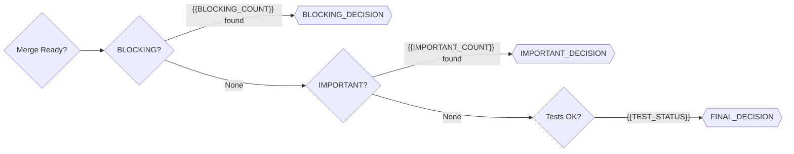

# PR Review Report — {{PR_TITLE}} (#{{PR_NUMBER}})

> Generated by `lz-pr-review` on {{DATE}}

---

## 📌 Business Context

**PR Type:** {{PR_TYPE}}
**Author:** @{{AUTHOR}}
**Branch:** `{{HEAD_BRANCH}}` → `{{BASE_BRANCH}}`
**Changes:** +{{ADDITIONS}} -{{DELETIONS}} across {{CHANGED_FILES}} files

### Business Intent
{{BUSINESS_INTENT_SUMMARY}}

### Requirements
{{REQUIREMENTS_CHECKLIST}}

---

## 🏗️ Change Architecture

```mermaid
graph TD
    subgraph "Changed Components"
        {{CHANGED_COMPONENTS}}
    end
    subgraph "Affected Systems"
        {{AFFECTED_SYSTEMS}}
    end
    {{STYLE_DIRECTIVES}}
```

### Change Map
| File | Layer | Change Type | Critical? | Lines ± |
|------|-------|-------------|-----------|---------|
{{CHANGE_MAP_ROWS}}

---

## 📊 PERFECT Scorecard

| Dimension | Score | Notes |
|-----------|-------|-------|
| **P**erformance | {{P_SCORE}} | {{P_NOTES}} |
| **E**dge Cases | {{E1_SCORE}} | {{E1_NOTES}} |
| **R**eliability | {{R_SCORE}} | {{R_NOTES}} |
| **F**orm | {{F_SCORE}} | {{F_NOTES}} |
| **E**vidence | {{E2_SCORE}} | {{E2_NOTES}} |
| **C**orrectness | {{C_SCORE}} | {{C_NOTES}} |
| **T**aste | {{T_SCORE}} | {{T_NOTES}} |

---

## 🔍 Review Findings

### Verdict: {{VERDICT_EMOJI}} {{VERDICT}}
**Risk Level:** {{RISK_LEVEL}}

{{#IF BLOCKING_COUNT > 0}}
### 🔴 BLOCKING ({{BLOCKING_COUNT}})

{{BLOCKING_FINDINGS}}
{{/IF}}

{{#IF IMPORTANT_COUNT > 0}}
### 🟠 IMPORTANT ({{IMPORTANT_COUNT}})

{{IMPORTANT_FINDINGS}}
{{/IF}}

{{#IF SUGGESTION_COUNT > 0}}
### 🟡 SUGGESTION ({{SUGGESTION_COUNT}})

{{SUGGESTION_FINDINGS}}
{{/IF}}

{{#IF NIT_COUNT > 0}}
### 🔵 NIT ({{NIT_COUNT}})

{{NIT_FINDINGS}}
{{/IF}}

{{#IF QUESTION_COUNT > 0}}
### ⚪ QUESTIONS ({{QUESTION_COUNT}})

{{QUESTION_FINDINGS}}
{{/IF}}

---

## ✅ What's Good

{{POSITIVE_CALLOUTS}}

---

## 🗺️ Requirements Traceability

| Requirement | Code Location | Test Coverage | Status |
|------------|---------------|---------------|--------|
{{TRACEABILITY_ROWS}}

---

## 🚦 Merge Decision



### Next Steps
{{NEXT_STEPS}}

---

*Review powered by [lz-pr-review](https://github.com/lutfi-zain/lz-stacks) — Six-Phase Pull Request Review*
