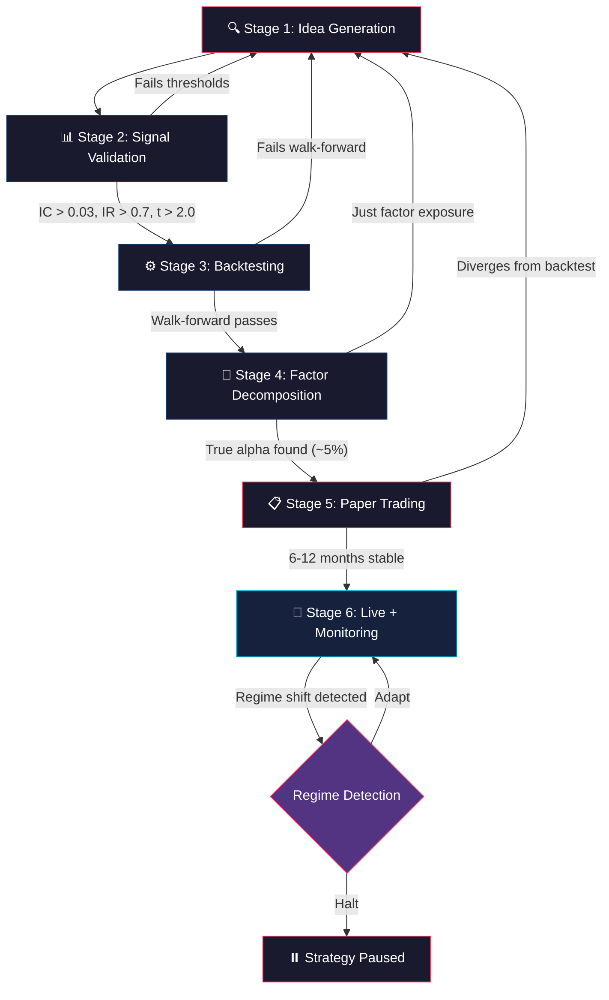

<div align="center">

# 🧠 lz-quant-researcher

**Elite Quantitative Research Mindset & Workflow for AI Agents**

[](https://opensource.org/licenses/MIT)
[](https://skills.sh)
[](https://python.org)
[](https://github.com/earendil-works/pi)
[](https://github.com/anthropics/claude-code)

*Codifies how elite quants think — from radical skepticism to production deployment.*

</div>

---

## Overview

`lz-quant-researcher` is an agent skill that transforms AI coding assistants into rigorous quantitative research scientists. It doesn't just tell the agent *what to do* — it teaches *how to think* about markets, models, and uncertainty.

The skill combines:
- **Persona-driven radical skepticism** — the agent assumes the backtest is always lying
- **Derman's "models are metaphors" philosophy** — financial models are not physics
- **Production code patterns** — walk-forward validation, IC calculation, regime detection
- **Automated validation rules** — machine-readable anti-pattern detectors
- **Executable scripts** — `validate.py` scans quant code for common failures

## ⚡ Quick Install

```bash
npx skills add lutfi-zain/lz-stacks --skill lz-quant-researcher
```

---

## How it Works

The skill implements a 6-stage quantitative research workflow, each with specific validation gates:



**Key insight:** Most strategies die between Stage 2 and Stage 4. The workflow is designed as a funnel — only ~5% of ideas survive to live trading.

---

## Skill Architecture

```
skills/lz-quant-researcher/
├── SKILL.md                         # Core skill: persona, philosophy, workflow
├── README.md                        # This file
├── references/
│   ├── patterns.md                  # Production Python: walk-forward, IC, stat arb, HMM
│   ├── sharp-edges.md               # 10 critical failure modes with detection/solutions
│   ├── validations.md               # 10 automated validation rules (regex + severity)
│   ├── mindset.md                   # Derman, Dalio, Kahneman, Taleb frameworks
│   └── risk-frameworks.md           # VaR, CVaR, Kelly, risk parity with Python code
├── scripts/
│   └── validate.py                  # Executable anti-pattern scanner for quant code
└── assets/
    └── backtest-checklist.md        # Pre/during/post backtest validation checklist
```

---

## The Research

This skill is grounded in primary sources from quantitative finance, behavioral economics, and the agent skills ecosystem:

| Source | Author(s) | Year | Contribution |
|--------|-----------|------|-------------|
| *Models.Behaving.Badly* | Emanuel Derman | 2011 | "Models are metaphors, not theories" — foundational philosophy |
| *Financial Modelers' Manifesto* | Derman & Wilmott | 2009 | The Modelers' Hippocratic Oath |
| *Active Portfolio Management* | Grinold & Kahn | 2000 | IC/IR framework, fundamental law of active management |
| *Principles: Life and Work* | Ray Dalio | 2017 | Systematic decision-making, risk parity, radical transparency |
| *Thinking, Fast and Slow* | Daniel Kahneman | 2011 | System 1/System 2 applied to trading decisions |
| *Antifragile* | Nassim Nicholas Taleb | 2012 | Building portfolios that gain from disorder |
| `quantitative-research` skill | omer-metin | 2025 | Persona-driven design, battle scars, reference file pattern |
| *QuantEvolve* (arXiv 2510.18569) | — | 2025 | Automated strategy discovery pipeline architecture |
| *Scientific Workflow for Alpha* | SetupAlpha | 2026 | IC validation and signal research methodology |
| *Quant Researcher Interview Guide* | G-Research | 2026 | What elite firms actually test for |

---

## Companion Skill

For general data science workflows (EDA, ML pipelines, A/B testing, stakeholder communication), use:

```bash
npx skills add lutfi-zain/lz-stacks --skill lz-data-science-core
```

---

<div align="center">
Built with 🧠 by <a href="https://github.com/lutfi-zain">Lutfi Zain</a>
</div>
