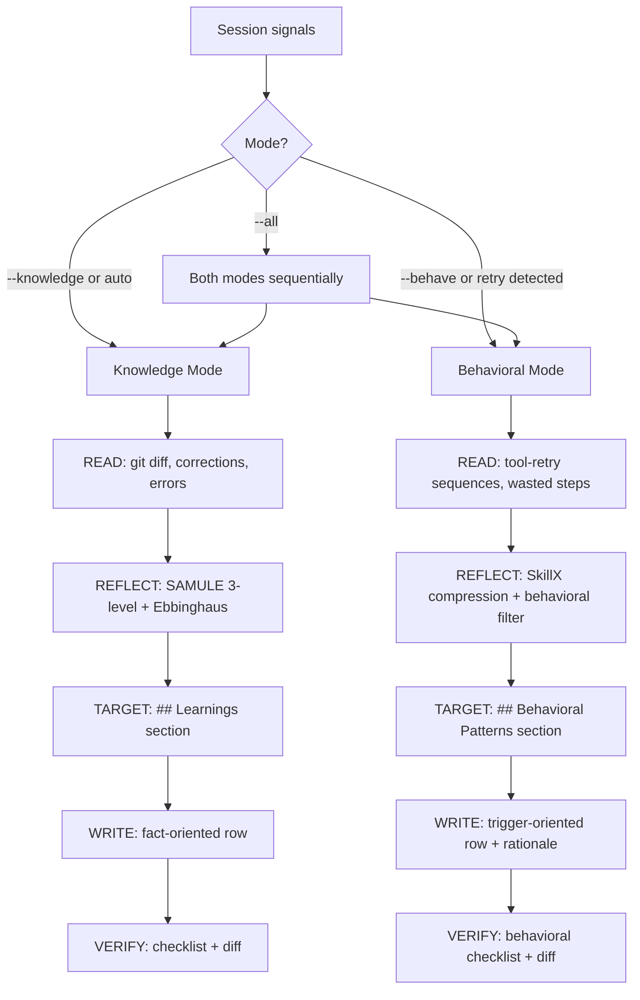

<div align="center">

# `lz-session-learn`

### *Read → Reflect → Write. Once. In the right mode.*

**Dual-mode reflective session memory for AI coding agents.**
**Knowledge Mode: project conventions. Behavioral Mode: agent conduct optimization.**

[](https://agentskills.io/specification)
[](https://github.com/earendil-works/pi)
[](https://github.com/anthropics/claude-code)
[](https://developers.openai.com/codex/skills)
[](#-the-research)
[](./SKILL.md)

`/session-learn` · `/session-learn --behave` · `/reflect` · `remember this` · `add to CLAUDE.md`

</div>

---

## Why this skill exists (v2)

Every AI coding session produces two kinds of signal:

1. **Project facts:** "use `pnpm test --run` in CI", "the repo uses Vitest", "never push to main"
2. **Agent behavioral patterns:** "I wasted 3 attempts before discovering `filter-log-events`", "I keep reaching for `execute-command` when `cat` would work", "I restarted from scratch instead of chaining from the previous session"

The original `lz-session-learn` v1 only captured **project facts**. The behavioral patterns — which determine *how efficiently the agent acts*, not just *what it knows* — were silently lost. Every new session, the agent would repeat the same retry sequences, rediscover the same workarounds, and frustrate the user with "start from scratch" behavior.

**v2 fixes this** with a **Dual-Mode Architecture**:

| Mode | Captures | Target section | Trigger |
| --- | --- | --- | --- |
| **Knowledge** | Project facts, conventions, corrections | `## Learnings` / `## Hard Rules` | User says a rule / fix |
| **Behavioral** (NEW) | Agent tool-choice patterns, retry compression, wasted-step elimination | `## Behavioral Patterns` | Agent wasted N retries before finding the right approach |

> *"The agent that cannot learn from its own session is doomed to repeat it. The agent that never fixes its behavior is doomed to waste N retries every session."*

---

## What it does

### Mode Selection

| Argument | Mode | Use case |
| --- | --- | --- |
| `/session-learn` | Auto-detect | Scans session for retry sequences → Behavioral; otherwise Knowledge |
| `/session-learn --knowledge` | **Knowledge** | "Remember this: use pnpm not npm" |
| `/session-learn --behave` | **Behavioral** (NEW) | "Stop wasting 3 attempts debugging ECS — just use filter-log-events" |
| `/session-learn --all` | Both | Run Knowledge first, then Behavioral |

### 5-Phase Loop (per mode)

| Phase | Name | Knowledge | Behavioral (NEW) |
| --- | --- | --- | --- |
| 1 | **READ** | Gather project signals: git diff, user corrections, build errors | Gather **tool-retry sequences**, wasted-step patterns, tool-choice anti-patterns |
| 2 | **REFLECT** | Classify micro/meso/macro (SAMULE), Ebbinghaus filter | Classify micro/meso-behavior (SkillX), **retention via "will this save N retries?"** |
| 3 | **TARGET** | Auto-detect file (`CLAUDE.md` > `AGENTS.md` > `MEMORY.md`) | Same files, but target `## Behavioral Patterns` section |
| 4 | **WRITE** | `- **[DATE]** Use X not Y — [evidence]` | `- **[DATE]** When [scenario]: skip X, start with Y. Rationale: ...` |
| 5 | **VERIFY** | Checklist + diff + budget | Same + behavioral-specific checks (scenario trigger, rationale, retry count) |



---

## The Research (v2)

This skill is grounded in **eight** independent research threads, combining **project-level knowledge extraction** with **agent-level behavioral optimization**.

### Behavioral Mode (NEW in v2)

| Source | Contribution | How `lz-session-learn` uses it |
| --- | --- | --- |
| **[SkillX](https://arxiv.org/abs/2604.04804)** (ICML 2026) | Hierarchical skill extraction from trajectories; filters out trial/error, keeps optimal path | The **retry compression** pattern in Behavioral Mode Phase 1 |
| **[Letta Skill Learning](https://www.letta.com/blog/skill-learning)** (2025) | Two-stage reflection (evaluate → create skill); 36.8% relative improvement on Terminal Bench | The **Reflection → Creation** pipeline Behavioral Mode uses to convert a trajectory into a behavioral row |
| **[Self-Improving Agents via Behavioral Rules](https://arxiv.org/abs/2607.13091)** (2026) | Closed-loop framework: human review feedback → codified behavioral rules → monotonic improvement | The **macro-behavior** level classification and de-dup pattern |
| **[Self-Improvements in Modern Agentic Systems survey](https://arxiv.org/abs/2607.13104)** (2026) | Comprehensive framework: agents as config coupling FM + scaffold of prompts/memory/tools/control | The dual-mode architecture itself: learning can target either the prompt (Knowledge) or the scaffold (Behavioral) |
| **[LLMs in the Imaginarium](https://arxiv.org/abs/2403.04746)** (2024) | Simulated trial and error with short-term and long-term memory for tool learning | The **retention filter** for behavioral patterns: short-term vs long-term behavioral rules |

### Knowledge Mode (v1 heritage, still used)

| Source | Contribution | How `lz-session-learn` uses it |
| --- | --- | --- |
| **[SAMULE](https://aclanthology.org/2025.emnlp-main.839.pdf)** (EMNLP 2025) | Multi-level reflection synthesis: micro/meso/macro | The 3-level classification in Knowledge Mode Phase 2 |
| **[MARS](https://arxiv.org/abs/2503.19271)** (Neurocomputing 2025) | Ebbinghaus-forgetting-curve retention thresholds | The Ebbinghaus retention score for Knowledge candidates |
| **[Memento 2](https://arxiv.org/pdf/2512.22716)** (2025) | Read-Write Reflective Learning — episodic memory as policy improvement | The 5-phase Read→Reflect→Write→Verify loop (shared between modes) |
| **[Contextual Experience Replay](https://aclanthology.org/2025.acl-long.694.pdf)** (ACL 2025) | Distills both successful and failed trajectories into reusable buffer | The skill treats failures as first-class signal, not noise |
| **[Anthropic — Effective context engineering](https://www.anthropic.com/engineering/effective-context-engineering-for-ai-agents)** (2025) | Compaction is lossy by design; structured notes survive | The skill writes *durable* notes, not transcripts |

Plus the same applied guides:

- **[Agent Skills Specification v1](https://agentskills.io/specification)** — `SKILL.md` frontmatter, progressive disclosure, allowed-tools.
- **[Anthropic — Skill authoring best practices](https://platform.claude.com/docs/en/agents-and-tools/agent-skills/best-practices)** — concise descriptions, one-skill-one-job, checklist-style exit criteria.
- **[amux — Context Engineering for AI Coding Agents](https://amux.io/guides/context-engineering/)** (2026) — six context surfaces; topic-file lazy-load math.

---

## Highlights

- **No transcript dumps.** Every persisted item passes the Ebbinghaus filter. Junk is dropped, not stored.
- **No full-file rewrites.** Always a surgical `Edit` on an existing `## Learnings` section.
- **No invented sections.** Reuses `## Learnings`, `## Corrections`, `## Hard Rules`. One new section per file, max.
- **No surprises.** Default behavior is `--dry-run`-equivalent: a diff is shown, then the write happens.
- **Idempotent.** Running twice on the same session converges; doesn't duplicate rows.
- **De-duplicates** by greping for keyword overlap before writing.
- **Budgets enforced** — 300-line `CLAUDE.md` cap, 200-line / 25KB `MEMORY.md` cap, with the option to spill over to topic files.

---

## 📦 Installation

Install via the `skills.sh` registry:

```bash
# Global
npx skills add lutfi-zain/lz-stacks --skill lz-session-learn -g

# Per-project
npx skills add lutfi-zain/lz-stacks --skill lz-session-learn
```

Or copy the `skills/lz-session-learn/` folder into your own `skills/` directory. It's fully self-contained.

---

## Usage

### Basic

> *"Run `/session-learn` — extract learnings from this session."*

The agent will:

1. Auto-detect the mode (or honor `--behave` / `--knowledge`).
2. Scan the session for the right signals (project facts or tool-retry patterns).
3. Classify each finding and apply the appropriate retention filter.
4. Detect the right target file and section (or ask once).
5. Show a diff and write surgically.

### Arguments

| Argument | Effect |
| --- | --- |
| `/session-learn` | Auto-detect mode + target |
| `/session-learn --knowledge` | Force **Knowledge Mode** (project facts) |
| `/session-learn --behave` | Force **Behavioral Mode** (agent conduct) |
| `/session-learn --all` | Run **both modes** sequentially |
| `/session-learn --behave claude` | Behavioral Mode → `CLAUDE.md` |
| `/session-learn --knowledge agents` | Knowledge Mode → `AGENTS.md` |
| `/session-learn --dry-run` | Show the diff; require confirmation before writing |
| `/session-learn --global` | Use global `~/.claude/.../memory/MEMORY.md` |

### When to trigger

- At the end of a non-trivial session ("we're done — `/session-learn`").
- Mid-session when the user says "remember this" or "add to CLAUDE.md".
- After a correction that the user has flagged as load-bearing.
- After a hard-won debugging session (high-signal, high-confidence).
- **After the agent wasted 2+ attempts before succeeding** — this is the highest-signal trigger for Behavioral Mode.
- **When the user says "you keep doing X" or "start from scratch"** — implicit behavioral pattern.

---

## File layout (v2)

```
lz-session-learn/
├── SKILL.md                              # Workflow + frontmatter (dual-mode)
├── README.md                             # This file
├── references/
│   ├── extraction-heuristics.md          # Signal taxonomy for both modes + retention filters
│   ├── target-detection.md               # Where to write, decision tree (both modes)
│   └── anti-rationalizations.md          # Excuses + rebuttals (now includes behavioral R15-R17)
└── assets/
    ├── BEHAVIORAL_SECTION.md             # NEW: Drop-in `## Behavioral Patterns` template
    ├── LEARNINGS_SECTION.md              # Drop-in `## Learnings` template (unchanged)
    ├── MEMORY_TOPIC.md                   # Auto-memory topic file template (unchanged)
    └── EXTRACTION_CHECKLIST.md           # Pre-write verification (updated for behavioral)
```

Progressive disclosure: only `SKILL.md` is loaded at activation. The `references/` and `assets/` files are loaded on demand by the agent, so the **activation cost stays under 5,000 tokens** (per Agent Skills spec).

---

## Worked examples

### Example 1: Knowledge Mode (project fact)

**Session**: User reports that `pnpm test` hangs in CI. Three restarts, same result. Fix turns out to be `pnpm test --run`.

**Invocation**: `/session-learn` (auto-detects Knowledge Mode — no retry sequence)

**Skill output**:

```
📚 lz-session-learn — Knowledge Mode, 1 durable learning (Ebbinghaus S=5)

→ Target: ./CLAUDE.md (auto-detected)
→ Section: ## Learnings (already exists, line 47)
→ Action:  surgical Edit, append 1 row to top of section

Diff:
+ - **2026-06-02** Use `pnpm test --run` in CI / one-shot contexts —
+   `[evidence: 3× CI exit 1, watch mode hangs without TTY]`

✅ Written. CLAUDE.md: 187 → 188 lines (budget: 300).
```

### Example 2: Behavioral Mode (retry compression)

**Session**: User asks to check an AWS ECS service config. Agent tries `execute-command` (fails), tries `list-tasks` (wrong level), then finally `describe-services` (succeeds).

**Invocation**: `/session-learn --behave`

**Skill output**:

```
🔧 lz-session-learn — Behavioral Mode, 1 behavioral pattern (S_b=6)

→ Target: ./AGENTS.md (auto-detected)
→ Section: ## Behavioral Patterns (newly created)
→ Action:  surgical Edit, inject `## Behavioral Patterns` + 1 row

Diff:
+## Behavioral Patterns
+
+> Agent behavioral optimizations derived from session trajectory analysis.
+
+- **[2026-06-02]** When user asks to check AWS ECS service: skip
+  `execute-command` and `list-tasks`, start with `describe-services` directly.
+  Rationale: execute-command needs SSM agent (not present on HIS containers);
+  list-tasks only shows running tasks, not service config.
+  Evidence: 2 wasted attempts → switched to describe-services → got config
+  immediately.

✅ Written. AGENTS.md: +7 lines (budget: no hard limit).
```

### Example 3: Both modes (`--all`)

**Session**: A debugging session that both found a project fact ("config is in Secrets Manager, not .env") AND had agent behavioral waste (checked Task Definition before Secrets Manager).

**Invocation**: `/session-learn --all`

**Skill output**: two writes — first to `## Learnings`, second to `## Behavioral Patterns`.

```
📚 lz-session-learn — Running both modes sequentially

[Knowledge] 1 fact: config is in Secrets Manager
  → ./CLAUDE.md ## Learnings

[Behavioral] 1 pattern: check Secrets Manager before Task Definition
  → ./AGENTS.md ## Behavioral Patterns

✅ Both modes complete.
```

---

## Compatibility

| Agent | Support | Notes |
| --- | --- | --- |
| **Claude Code** | ✅ Full | Native — works with auto-memory, hooks, subagents |
| **Pi** | ✅ Full | Same `SKILL.md` frontmatter, same `Bash`/`Edit` tools |
| **OpenAI Codex** | ✅ Full | Spec-compliant; works with `$session-learn` invocation |
| **Cursor / Windsurf** | ⚠️ Partial | `SKILL.md` is read; `MEMORY.md` target needs manual mapping |
| **Generic agents** | ✅ | Any agent implementing the [Agent Skills spec](https://agentskills.io) |

---

## Security & auditing

- The skill **never** persists secrets, tokens, API keys, customer data, or PII. See [anti-rationalization R11](./references/anti-rationalizations.md) and the extraction checklist's "No secrets / PII" gate.
- It uses only the agent's native `Read`, `Edit`, `Bash(git:*)`, `Bash(grep:*)`, `Bash(date)`, `Bash(wc)` — no obfuscated binaries, no network calls.
- All writes are shown to the user as a diff before commit (unless `--dry-run` is omitted and the user has explicitly opted in to silent writes via the agent's permission system).

---

## See also

- [`lz-create-agentsmd`](./../lz-create-agentsmd/SKILL.md) — greenfield `AGENTS.md` generator (Phase 1 of the project lifecycle).
- [`lz-daily-reflect`](./../lz-daily-reflect/SKILL.md) — human-facing daily reflection (end-of-day journaling).
- [Agent Skills specification](https://agentskills.io/specification) — the open format this skill implements.
- [Claude Code memory docs](https://code.claude.com/docs/en/memory) — the auto-memory system this skill writes into.
- [SkillX: Automatically Constructing Skill Knowledge Bases](https://arxiv.org/abs/2604.04804) — trajectory compression research that inspired Behavioral Mode.
- [Letta Skill Learning](https://www.letta.com/blog/skill-learning) — reflection-creation pipeline for agent skills.

---

<div align="center">
  <i>Built with the Read–Write Reflective Learning paradigm.</i><br>
  <i>For agents that don't want to repeat themselves — and don't want to waste retries doing it.</i>
</div>
