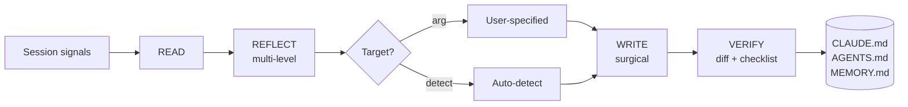

<div align="center">

# `lz-session-learn`

### *Read → Reflect → Write. Once.*

**Reflective session memory for AI coding agents.**
**Turns ephemeral context into durable project rules — without bloating it.**

[](https://agentskills.io/specification)
[](https://github.com/earendil-works/pi)
[](https://github.com/anthropics/claude-code)
[](https://developers.openai.com/codex/skills)
[](#-the-research)
[](./SKILL.md)

`/session-learn` · `/learn` · `/reflect` · `remember this` · `add to CLAUDE.md`

</div>

---

## Why this skill exists

Every AI coding session produces *some* correction, *some* new convention, *some* "actually, no, do it this way". Without a deliberate capture step, that signal dies in the next `/compact` and gets re-discovered (and re-paid) in the next session.

> *"The agent that cannot learn from its own session is doomed to repeat it. The agent that writes its learnings badly is doomed to bloat its own context."*

`lz-session-learn` is the deliberate capture step. It runs a **5-phase Read–Write reflective loop** (see below), filters candidates with an **Ebbinghaus-style retention score** (so junk doesn't pollute your hot files), and surgically injects only the survivors into the right surface — `CLAUDE.md`, `AGENTS.md`, `MEMORY.md`, or a topic file.

It is the only skill in the `lz-stacks` collection that **writes into** `CLAUDE.md` rather than generating it from scratch. (For greenfield `AGENTS.md` generation, see [`lz-create-agentsmd`](./../lz-create-agentsmd/SKILL.md).)

---

## What it does

| Phase | Name | What happens |
| --- | --- | --- |
| 1 | **READ** | Gathers session signals (tool-call trail, user corrections, repeated patterns, errors, decisions). Prefers evidence over narration. |
| 2 | **REFLECT** | Classifies each candidate at **micro / meso / macro** level (per SAMULE, EMNLP 2025) and applies an **Ebbinghaus retention score** to filter junk. |
| 3 | **TARGET** | Auto-detects the right destination (`CLAUDE.md` > `AGENTS.md` > `MEMORY.md` > custom), or honors a user argument. |
| 4 | **WRITE** | Surgically injects into an existing `## Learnings` anchor — never overwrites, never dumps, never invents sections. |
| 5 | **VERIFY** | Runs a checklist, shows a diff, enforces the 300-line `CLAUDE.md` / 200-line `MEMORY.md` budget. |



---

## The Research

This skill is grounded in five independent research threads, all converging on the same conclusion: **reflection + structured memory = agent improvement without fine-tuning**.

| Source | Contribution | How `lz-session-learn` uses it |
| --- | --- | --- |
| **[SAMULE](https://aclanthology.org/2025.emnlp-main.839.pdf)** (EMNLP 2025) | Multi-level reflection synthesis: micro (single trajectory) / meso (intra-task) / macro (inter-task) | The 3-level classification in Phase 2 |
| **[MARS](https://arxiv.org/abs/2503.19271)** (Neurocomputing 2025) | Ebbinghaus-forgetting-curve retention thresholds; long-term vs. short-term memory | The retention score that filters candidates |
| **[Memento 2](https://arxiv.org/pdf/2512.22716)** (2025) | Read-Write Reflective Learning — episodic memory as policy improvement without fine-tuning | The 5-phase Read→Reflect→Write→Verify loop |
| **[Contextual Experience Replay](https://aclanthology.org/2025.acl-long.694.pdf)** (ACL 2025) | Distills both successful and failed trajectories into a reusable buffer | The skill treats failures as first-class signal, not noise |
| **[Anthropic — Effective context engineering](https://www.anthropic.com/engineering/effective-context-engineering-for-ai-agents)** (2025) | Compaction is lossy by design; structured notes survive what transcripts cannot | The skill writes *durable* notes, not transcripts |

Plus three applied guides that shaped the design:

- **[Agent Skills Specification v1](https://agentskills.io/specification)** — `SKILL.md` frontmatter, progressive disclosure, allowed-tools.
- **[Anthropic — Skill authoring best practices](https://platform.claude.com/docs/en/agents-and-tools/agent-skills/best-practices)** — concise descriptions, one-skill-one-job, checklist-style exit criteria.
- **[amux — Context Engineering for AI Coding Agents](https://amux.io/guides/context-engineering/)** (2026) — six context surfaces; ~70% `CLAUDE.md` adherence; topic-file lazy-load math.

---

## Highlights

- **No transcript dumps.** Every persisted item passes the Ebbinghaus filter. Junk is dropped, not stored.
- **No full-file rewrites.** Always a surgical `Edit` on an existing `## Learnings` section.
- **No invented sections.** Reuses `## Learnings`, `## Corrections`, `## Hard Rules`. One new section per file, max.
- **No surprises.** Default behavior is `--dry-run`-equivalent: a diff is shown, then the write happens.
- **Idempotent.** Running twice on the same session converges; doesn't duplicate rows.
- **De-duplicates** by greping for keyword overlap before writing.
- **Budgets enforced** — 300-line `CLAUDE.md` cap, 200-line / 25KB `MEMORY.md` cap, with the option to spill over to topic files.

---

## 📦 Installation

Install via the `skills.sh` registry:

```bash
# Global
npx skills add lutfi-zain/lz-stacks --skill lz-session-learn -g

# Per-project
npx skills add lutfi-zain/lz-stacks --skill lz-session-learn
```

Or copy the `skills/lz-session-learn/` folder into your own `skills/` directory. It's fully self-contained.

---

## Usage

### Basic

> *"Run `/session-learn` — extract learnings from this session into our `CLAUDE.md`."*

The agent will:

1. Scan the conversation for corrections, patterns, and decisions.
2. Classify each finding at micro / meso / macro level.
3. Filter with the Ebbinghaus retention score.
4. Detect the right target file (or ask once).
5. Show a diff and write surgically.

### Arguments

| Argument | Effect |
| --- | --- |
| `/session-learn` | Auto-detect target |
| `/session-learn claude` | Force write to `CLAUDE.md` |
| `/session-learn agents` | Force write to `AGENTS.md` |
| `/session-learn memory` | Force write to `MEMORY.md` (auto-memory) |
| `/session-learn <path>` | Write to custom path |
| `/session-learn --dry-run` | Show the diff; require confirmation before writing |
| `/session-learn --global` | Use global `~/.claude/.../memory/MEMORY.md` |

### When to trigger

- At the end of a non-trivial session ("we're done — `/session-learn`").
- Mid-session when the user says "remember this" or "add to CLAUDE.md".
- After a correction that the user has flagged as load-bearing.
- After a hard-won debugging session (high-signal, high-confidence).

---

## File layout

```
lz-session-learn/
├── SKILL.md                              # Workflow + frontmatter
├── README.md                             # This file
├── references/
│   ├── extraction-heuristics.md          # Signal taxonomy + Ebbinghaus score
│   ├── target-detection.md               # Where to write, decision tree
│   └── anti-rationalizations.md          # Excuses the agent makes + rebuttals
└── assets/
    ├── LEARNINGS_SECTION.md              # Drop-in `## Learnings` template
    ├── MEMORY_TOPIC.md                   # Auto-memory topic file template
    └── EXTRACTION_CHECKLIST.md           # Pre-write verification
```

Progressive disclosure: only `SKILL.md` is loaded at activation. The `references/` and `assets/` files are loaded on demand by the agent, so the **activation cost stays under 5,000 tokens** (per Agent Skills spec).

---

## Worked example

**Session**: User reports that `pnpm test` hangs in CI. Three restarts, same result. Fix turns out to be `pnpm test --run`.

**Invocation**: `/session-learn`

**Skill output (abbreviated)**:

```
📚 lz-session-learn — extracting 1 durable learning (Ebbinghaus S=5)

→ Target: ./CLAUDE.md (auto-detected)
→ Section: ## Learnings (already exists, line 47)
→ Action:  surgical Edit, append 1 row to top of section

Diff:
+ ## Learnings
+
+ - **2026-06-02** Use `pnpm test --run` in CI / one-shot contexts —
+   `[evidence: 3× CI exit 1, watch mode hangs without TTY]`

✅ Written. CLAUDE.md: 187 → 188 lines (budget: 300). ✅
```

If the user runs `/session-learn --dry-run`, only the diff is shown, and the write waits for explicit confirmation.

---

## Compatibility

| Agent | Support | Notes |
| --- | --- | --- |
| **Claude Code** | ✅ Full | Native — works with auto-memory, hooks, subagents |
| **Pi** | ✅ Full | Same `SKILL.md` frontmatter, same `Bash`/`Edit` tools |
| **OpenAI Codex** | ✅ Full | Spec-compliant; works with `$session-learn` invocation |
| **Cursor / Windsurf** | ⚠️ Partial | `SKILL.md` is read; `MEMORY.md` target needs manual mapping |
| **Generic agents** | ✅ | Any agent implementing the [Agent Skills spec](https://agentskills.io) |

---

## Security & auditing

- The skill **never** persists secrets, tokens, API keys, customer data, or PII. See [anti-rationalization R11](./references/anti-rationalizations.md) and the extraction checklist's "No secrets / PII" gate.
- It uses only the agent's native `Read`, `Edit`, `Bash(git:*)`, `Bash(grep:*)`, `Bash(date)`, `Bash(wc)` — no obfuscated binaries, no network calls.
- All writes are shown to the user as a diff before commit (unless `--dry-run` is omitted and the user has explicitly opted in to silent writes via the agent's permission system).

---

## See also

- [`lz-create-agentsmd`](./../lz-create-agentsmd/SKILL.md) — greenfield `AGENTS.md` generator (Phase 1 of the project lifecycle).
- [`lz-daily-reflect`](./../lz-daily-reflect/SKILL.md) — human-facing daily reflection (end-of-day journaling).
- [Agent Skills specification](https://agentskills.io/specification) — the open format this skill implements.
- [Claude Code memory docs](https://code.claude.com/docs/en/memory) — the auto-memory system this skill writes into.

---

<div align="center">
  <i>Built with the Read–Write Reflective Learning paradigm.</i><br>
  <i>For agents that don't want to repeat themselves.</i>
</div>
