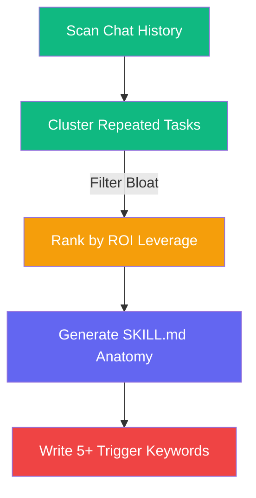

<div align="center">

# 🛠️ lz-skill-forge

**Metadata Utility: Build & Discover Reusable AI Agent Skills**

[](https://skills.sh)
[](https://opensource.org/licenses/MIT)

</div>

---

## Overview

A tooling utility designed to simplify skill creation and discovery in the open agent skills ecosystem. `lz-skill-forge` parses chat logs, highlights high-leverage repetition, and formats new skills into the standard `SKILL.md` layout with trigger-optimized metadata.

## How it Works



## Absorbed Skills
Consolidates 2 meta-tooling draft skills:
- **skill-builder** → `references/skill-anatomy.md`
- **skill-opportunity-finder** → `references/opportunity-scanning.md`

## The Research

| Source | Concept | Application |
|---|---|---|
| Agent Skills Spec v1 | Trigger Optimization | Writing YAML metadata descriptions containing 5+ specific trigger phrases to maximize auto-invocation probability |
| Workspace Productivity Audit | Leverage-based Automation | Prioritizing workflows based on execution frequency multiplied by time saved |

## Install

```bash
npx skills add lutfi-zain/lz-stacks --skill lz-skill-forge
```
