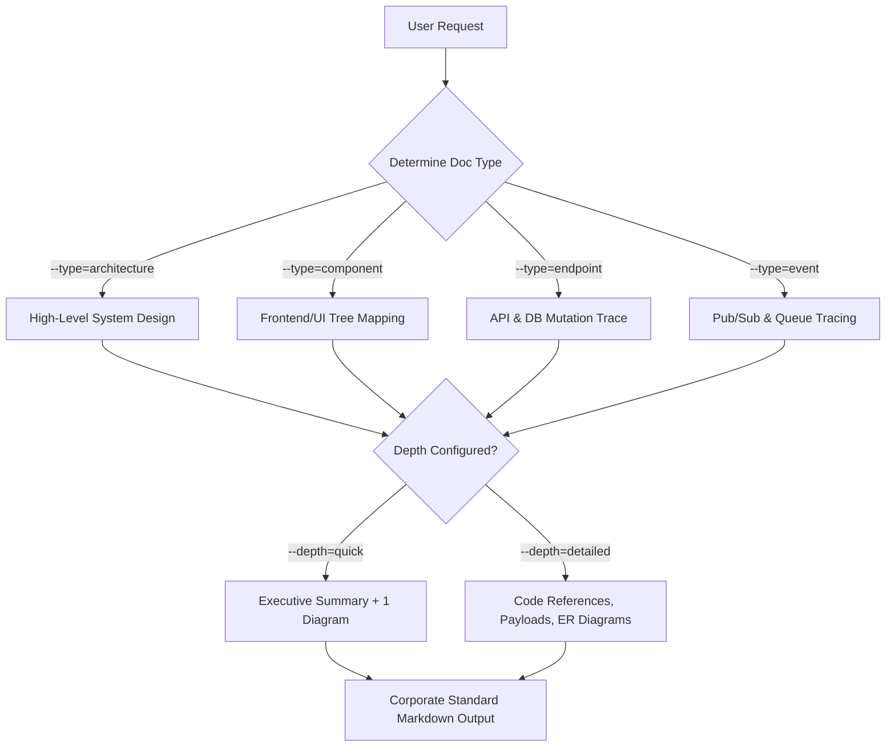

<div align="center">

# 🏛️ lz-tech-doc-architect

**Enterprise Technical Writer & Architecture Documentation Engine**

[](#)
[](https://opensource.org/licenses/MIT)
[](#)

*A comprehensive documentation standard that translates complex code across Frontend, Backend, Databases, and Event-Driven systems into clear, diagram-rich Technical Documentation.*

</div>

---

## 🚀 Overview

`lz-tech-doc-architect` is not just an API endpoint mapper; it is a full-fledged **Technical Documentation Engine**. It bridges the gap between raw codebase implementations and enterprise-standard Architecture Design Documents, Component Specifications, and System Blueprints.

Whether you need to map a React component tree, trace an event-driven pub/sub architecture, or document a REST API, this skill generates beautifully formatted markdown packed with syntax-safe Mermaid diagrams.

---

## 🧠 How it Works

The skill operates on an adaptive documentation framework:



---

## 📚 References & Skill DNA

This skill compiles methodologies from several highly successful, popular agent skills in the ecosystem. 

| Original Inspiration | Area of Expertise Adopted |
| :--- | :--- |
| `spillwavesolutions/design-doc-mermaid` | Rigorous use of Mermaid diagrams for visual documentation (Sequence, C4, Flowcharts) and syntax safety. |
| `addyosmani/documentation-and-adrs` | Enterprise-standard markdown structuring, readable layouts, and ADR (Architecture Decision Record) standards. |
| `awesome-copilot/architecture-blueprint` | Identifying and mapping cross-system boundaries (System Context mapping). |
| `jeffallan/microservices-architect` | Handling bounded contexts and event-driven microservices logic. |
| `lutfi-zain/lz-kairos-debugger` | Enforcing code-level verification instead of assumptions. |

### How to Update This Skill
To ensure this skill stays up-to-date with industry standards:
1. **Diagramming Syntax**: Monitor `spillwavesolutions/design-doc-mermaid` for updates to Mermaid's syntax (e.g., new diagram types like Mindmaps or Quadrant Charts). Update `./references/mermaid-best-practices.md`.
2. **Frontend Paradigms**: As frontend frameworks evolve (React Server Components, Astro Islands, Vue Composition), adapt the Component tracing methodology in `SKILL.md`.
3. **Documentation Layouts**: Check `addyosmani/documentation-and-adrs` for evolving corporate practices (e.g., adding SLO/SLI tracking or Threat Modeling templates).

---

## 📁 File Structure

```
lz-tech-doc-architect/
├── SKILL.md                              # Core documentation logic & routing
├── README.md                             # This file
├── references/
│   └── mermaid-best-practices.md         # Syntax rules & diagram requirements
└── assets/
    ├── doc-template-architecture.md      # Template for high-level systems
    ├── doc-template-component.md         # Template for FE (React/Angular/Astro)
    ├── doc-template-endpoint.md          # Template for REST/GraphQL APIs
    └── doc-template-event.md             # Template for Kafka/RabbitMQ/PubSub
```

---

<div align="center">
Built for large-scale engineering teams. Part of the <b>lz-stacks</b> collection.
</div>
