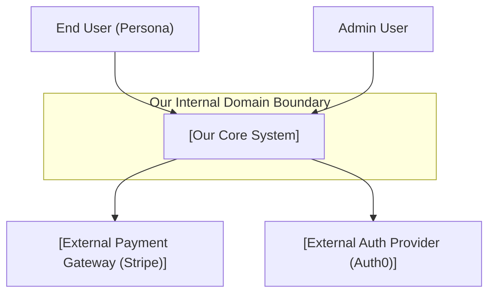
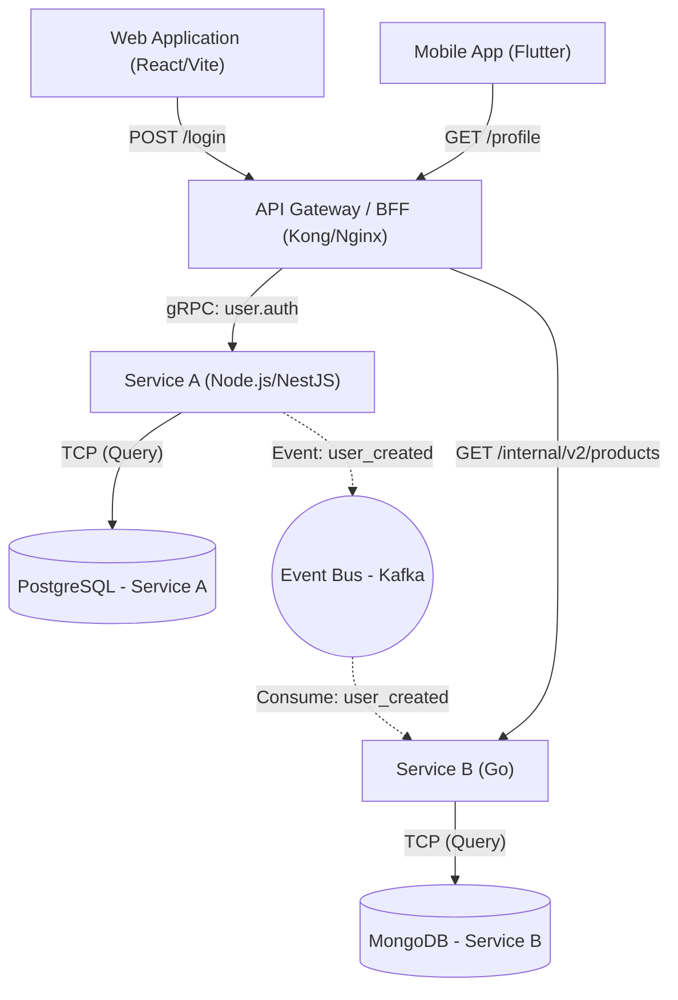

# System Architecture Design (SAD)

**System / Domain:** `[Domain Name]`
**Version:** `1.0`
**Architect/Owner:** `[Team/Owner Name]`

---

## 1. Business Context & Triggers
*When and why is this system architecture utilized?*

- **Core Problem Solved**: `[e.g., Processes high-throughput streaming data for fraud detection]`
- **Primary Triggers**: `[e.g., Triggered every time a user swipes a credit card]`

---

## 2. System Context (C4 Level 1)

*High-level view of users, our system boundary, and external systems.*

---

## 2. Container Architecture (C4 Level 2)

*Major deployable units, tech stacks, and network communications.*

---

## 3. Technology Stack & Data Contracts

### A. Tech Stack
| Component | Technology | Responsibility |
| :--- | :--- | :--- |
| **Frontend** | `[e.g., Next.js]` | `[e.g., SSR, Routing, UI]` |
| **Backend A** | `[e.g., Go]` | `[e.g., High-throughput payment processing]` |
| **Database A** | `[e.g., PostgreSQL]` | `[e.g., Relational ACID compliance]` |

### B. Inter-Service Communication
- **Synchronous**: `[e.g., REST API over HTTPS for User Profiles]`
- **Asynchronous**: `[e.g., Kafka Topics for Order Fulfillment]`

---

## 4. Architecture Decision Records (ADRs)

*For `--depth=detailed`: Document key engineering decisions.*

### Decision 1: `[e.g., Using MongoDB instead of Postgres for Service B]`
- **Status**: `[Accepted]`
- **Context**: `[Service B deals with highly unstructured product metadata coming from 3rd party vendors.]`
- **Decision**: `[Adopt MongoDB for schema flexibility.]`
- **Consequences**: 
  - *Pros*: Faster iteration on product schemas.
  - *Cons*: Cannot do complex cross-collection joins easily.
