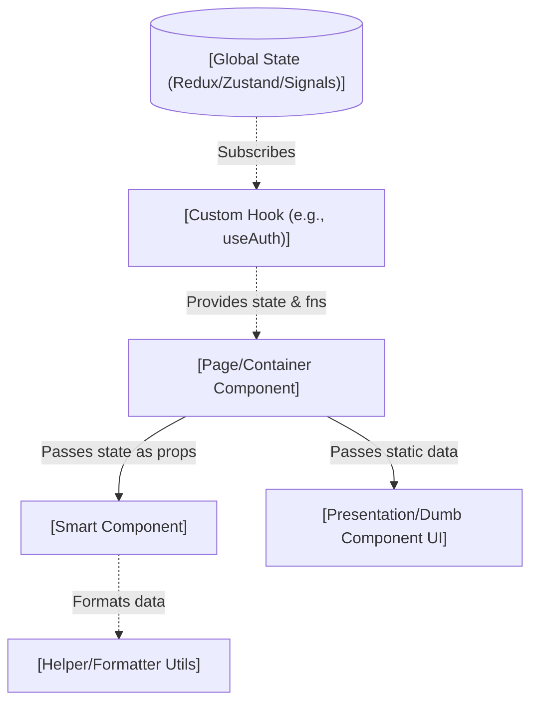
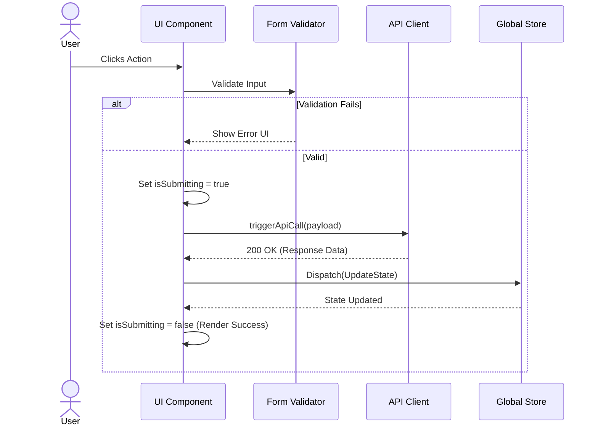

# Detailed Frontend Component Design: `[Component Name]`

**Framework:** `[React / Angular / Astro / Vue]`
**Location:** `[Path to file]`
**Scope:** `[e.g., User Login Form, Dashboard Grid]`

---

## 1. Component Architecture & Data Flow

*Hierarchy of UI components, Hooks, and State Stores.*

---

## 2. Consumers & Usages (Upward Trace)
*Where and when this component is used in the codebase.*

- **Parent/Consumers**: 
  - `[ParentComponentA]`: Renders this component during `[Condition/Route]`.
  - `[ParentComponentB]`: Uses this component for `[Specific Feature]`.
- **Trigger/Interaction Context**: `[When does the user interact with this? e.g., Only after checkout]`

---

## 3. Technical Implementation Details

### A. State Management
- **Local State (`useState`, etc.)**: 
  - `[stateVarName]` (`Type`): What it controls (e.g., UI toggle, loading spinner).
- **Global State / Context**:
  - `[Store Slice / Context Name]`: What specific selectors/values are consumed.

### B. Props (Data Contracts)
| Prop Name | Type | Required? | Description & Origin |
| :--- | :--- | :--- | :--- |
| `exampleProp` | `string` | Yes | Passed from `[ParentComponent]`. |

### C. Lifecycle & Hooks
- `[e.g., useEffect / onMount]`: What happens when the component mounts? (e.g., "Fetches initial user data by calling `fetchUserData()`").
- **Custom Hooks**: 
  - `[e.g., useDebounce]`: Prevents API spamming on search input.

### D. Data Transformations & Helpers
- **Helper Files Used**: `[GitHub Link to helper/util]`
- **Transformations**:
  - `[e.g., Raw API Date string (ISO8601) -> formatTimeAgo() -> "2 hours ago" for UI display]`
  - `[e.g., Array filtering before map() rendering]`

### E. User Interactions & Event Handlers
1. **`onClick / onSubmit`**:
   - What function is triggered? `[e.g., handleFormSubmit]`
   - What validation runs before submission? `[e.g., Zod schema validation]`
   - Which API endpoint is called? `[e.g., POST /api/login]`

---

## 3. UI-to-API Interaction (Sequence)

*Chronological flow from User click to UI update.*

