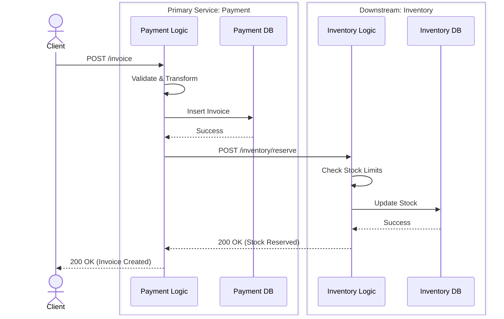
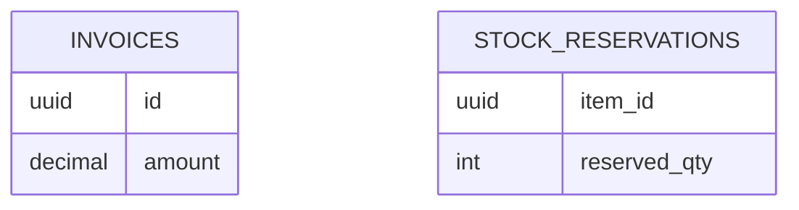

# End-to-End Integration Trace: `[ENTRY_METHOD] [ENTRY_PATH]`

**Entry Service:** `[Primary Service Name]`
**Downstream Services:** `[List of downstream services hit]`
**Module/Domain:** `[Domain Name]`
**Description:** `[Comprehensive description of business purpose]`

---

## 1. Executive Integration Summary
*(For `--depth=quick`, this section is the primary focus)*

**High-Level Flow:**
`[e.g., The Client calls the Payment Service to create an invoice. The Payment Service inserts the invoice data into the 'invoices' table, and then synchronously calls the Inventory Service to reserve stock. Finally, it calls the Notification Service to send an email, ending with an insert into the 'email_logs' table.]`

---

## 2. End-to-End Execution Flow (Sequence)

*Detailed chronological flow mapping cross-service integrations and internal layers.*



---

## 3. Deep Dive: [Primary Service Name] Internals
> **Note**: Sections below are populated extensively when `--depth=detailed` is used.

### A. Business Logic & Transformations
- **File Reference**: `[GitHub Link to service file]`
- **Step-by-Step Logic**:
  1. `[e.g., Calculates total amount from line items]`
  2. `[e.g., Transforms input array to DB models]`
- **Data Transformations**: `[e.g., Date strings are cast to UTC Timestamps]`

### B. Repository Operations
- **File Reference**: `[GitHub Link to repository file]`
- **Key Queries**:
  - `[e.g., INSERT INTO invoices...]`

### C. Downstream Calls Made
- **Target Endpoint**: `[METHOD] [PATH]` on `[Service Name]`
- **Payload Sent**: 
```json
{ "key": "value" }
```

---

## 4. Deep Dive: [Downstream Service Name 1] Internals
*(Repeat this section for EVERY downstream service traced)*

### A. Business Logic & Transformations
- **File Reference**: `[GitHub Link to downstream service]`
- **Step-by-Step Logic**: `[Explain logic executed in this service]`

### B. Repository Operations
- **Key Queries**: `[e.g., UPDATE stock...]`

---

## 5. Database Mutations (ER Diagram)
*Global schema of ALL tables impacted across ALL services in this flow.*


