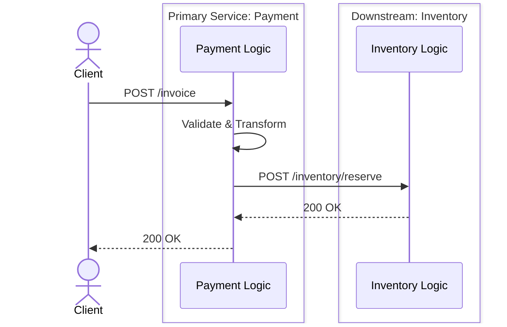
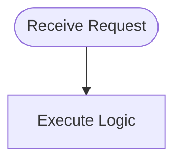
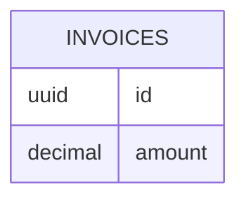

# End-to-End Integration Trace: `[ENTRY_METHOD] [ENTRY_PATH]`

**Entry Service:** `[Primary Service Name]`
**Downstream Services:** `[List of downstream services hit]`
**Module/Domain:** `[Domain Name]`
**Description:** `[Comprehensive description of business purpose]`

---

## 1. Executive Integration Summary
*(For `--depth=quick`, this section is the primary focus)*

**High-Level Flow:**
`[e.g., The Client calls the Payment Service to create an invoice. The Payment Service inserts the invoice data into the 'invoices' table, and then synchronously calls the Inventory Service to reserve stock. Finally, it calls the Notification Service to send an email, ending with an insert into the 'email_logs' table.]`

---

## 2. End-to-End Execution Flow (Sequence)

*Detailed chronological flow mapping cross-service integrations.*



---

## 3. Deep Dive: [Primary Service Name] Internals
> **Note**: This section MUST be repeated for EVERY single service in the chain. Do NOT summarize multiple services into one block.

### A. Internal Logic & Conditions (Flowchart)
*You MUST draw a flowchart for this specific service's internal business logic, strictly capturing `if/else` conditions and validations.*

```mermaid
flowchart TD
    Start([Receive Request]) --> Validate{Is Payload Valid?}
    Validate -- No --> Return400[Return 400 Bad Request]
    Validate -- Yes --> CheckCondition{Is [Condition] Met?}
    
    CheckCondition -- True --> ExecTrue[Execute True Logic]
    ExecTrue --> CallHelper[Call Helper: TransformData]
    CallHelper --> InsertDB[Insert into TABLE_NAME]
    
    CheckCondition -- False --> ExecFalse[Execute False Logic]
    ExecFalse --> UpdateDB[Update TABLE_NAME]
    
    InsertDB --> CallExt[Call Downstream API]
    UpdateDB --> CallExt
```

### B. Business Logic, Formulas & Assets
- **File Reference**: `[GitHub Link to service file]`
- **Step-by-Step Logic**:
  1. `[Explain what happens at each step in the flowchart above]`
- **Formulas & Calculations**: `[e.g., total = base_price * (1 - discount_rate) + tax]`
- **Generated Assets/Documents**: `[e.g., Generates PDF invoice and uploads to S3 bucket 'invoices-prod']`
- **Data Transformations**: `[e.g., Date strings are cast to UTC Timestamps]`

### C. Repository Operations
- **File Reference**: `[GitHub Link to repository file]`
- **Key Queries**:
  - `[e.g., INSERT INTO invoices...]`

### D. Downstream Calls Made
- **Target Endpoint**: `[METHOD] [PATH]` on `[Service Name]`
- **Payload Sent**: 
```json
{ "key": "value" }
```

---

## 4. Deep Dive: [Downstream Service Name 1] Internals
*(You MUST repeat the exact structure of Section 3 here, including the Internal Logic Flowchart capturing its specific `if/else` conditions!)*

### A. Internal Logic & Conditions (Flowchart)

*(Expand this diagram for this specific service)*

### B. Business Logic, Formulas & Assets
- **File Reference**: `[GitHub Link to downstream service]`
- **Step-by-Step Logic**: `[Explain logic executed in this service]`

### C. Repository Operations
- **Key Queries**: `[e.g., UPDATE stock...]`

---

## 5. Database Mutations (ER Diagram)
*Global schema of ALL tables impacted across ALL services in this flow.*


