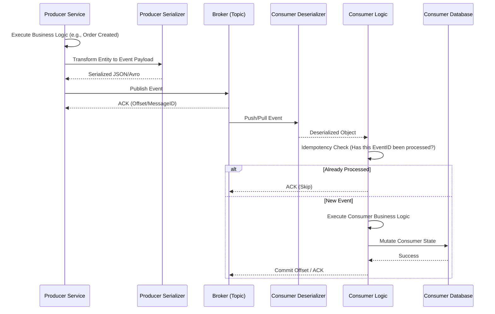

# Event-Driven Flow: `[Topic / Message Queue Name]`

**Pattern:** `[Pub/Sub, Point-to-Point, Stream, Event Sourcing]`
**Broker:** `[Kafka / RabbitMQ / SQS / Redis]`
**Domain:** `[Domain Name]`

---

## 1. Deep Event Lifecycle (Sequence Diagram)

*Chronological flow from Producer Business Logic to Consumer DB writes.*



---

## 2. Producer Internals

### A. Trigger Conditions (Business Logic)
- **When is this event fired?**: `[e.g., After a successful payment charge in the PaymentService]`
- **File Reference**: `[GitHub Link to Publisher/Service]`

### B. Data Transformation (Serialization)
- **How is the payload built?**: `[e.g., Maps internal PaymentEntity to PaymentCompletedIntegrationEvent]`
- **Schema Validation**: `[e.g., Avro Schema, JSON Schema]`

---

## 3. Consumer Internals

### A. Idempotency & Concurrency
- **Idempotency Strategy**: `[e.g., Checks if EventID exists in 'processed_events' table before executing]`
- **Concurrency/Ordering**: `[e.g., Ordered by Partition Key (userId)]`

### B. Business Logic & Transformations
- **File Reference**: `[GitHub Link to Consumer/Listener]`
- **Transformations**: `[e.g., Maps incoming Event payload into local UserEntity for saving]`
- **Database Operations**: `[e.g., Updates the User's 'premium_status' flag in the Consumer's isolated DB]`

### C. Error Handling (DLQ)
- **Retry Policy**: `[e.g., Exponential backoff, max 3 retries]`
- **Dead Letter Queue (DLQ)**: `[Name of the DLQ Topic]`
- **Fallback Logic**: `[What happens when it goes to DLQ? e.g., Alert to Slack]`

---

## 4. Event Data Contract

**Payload Schema:**
```json
{
  "eventId": "uuid",
  "eventType": "string",
  "timestamp": "ISO8601",
  "data": {
    // Specific business fields
  }
}
```
