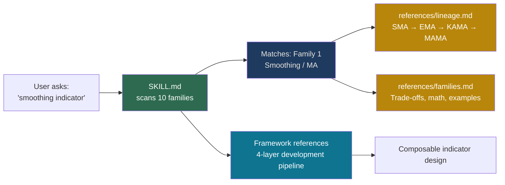

# lz-technical-indicator-architect — Statistical Architect for Technical Indicators

[]()
[]()
[]()

**10 statistical families** behind every technical indicator, from SMA to HMM.
Agent learns the trade-offs (smoothing vs lag, adaptivity vs complexity) and
knows exactly which family to use for any indicator task.

## How It Works



## The Research

Based on exhaustive survey of 65 sources including:

- Lo, Mamaysky, Wang (2000). *Foundations of Technical Analysis*. Journal of Finance. — the seminal paper bridging statistical inference and technical patterns.
- Feng & Palomar (2016). *A Signal Processing Perspective on Financial Engineering*. Foundations and Trends in Signal Processing. — the definitive DSP-finance crossover.
- Ehlers, J. (2001–2025). *MESA Adaptive Moving Averages* and 20+ technical papers. — the pioneer of DSP-based indicators.
- Jiang et al. (2022). *Penalized Logistic Regressions with Technical Indicators*. PMC. — demonstrates auto-selection of indicators via MCP/SCAD regularization.

Full source table available in research report `tmp/research_statistical-principles-technical-indicators_20260619.md`.

## Skill Structure

```
skills/lz-technical-indicator-architect/
├── SKILL.md                  <200 lines — quick reference + triggers
├── README.md                 this file
├── references/
│   ├── families.md           Deep docs for 10 families (math, implementation)
│   ├── lineage.md            Moving average evolution tree + filter comparison
│   └── framework.md          4-layer development pipeline + best practices
```

## Usage

Trigger: mention indicator design, smoothing, filtering, regression, spectral,
fractal, GARCH, entropy, HMM, wavelet, or related terms.

Agent then loads SKILL.md → identifies family → loads relevant reference file
for deep implementation guidance.
