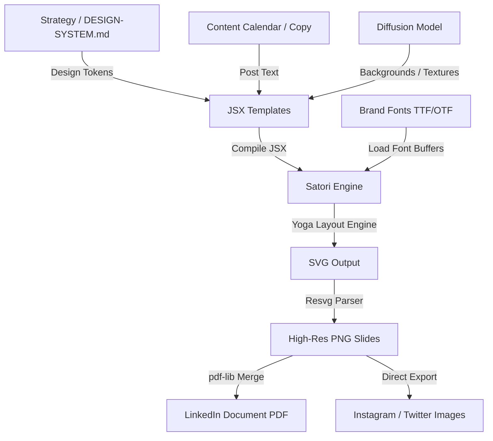

# lz-visual-forge

[](https://github.com/vercel/satori)
[](https://github.com/yisibl/resvg-js)
[](https://github.com/pdf-lib/pdf-lib)
[](../../LICENSE)

Programmatic visual content generator for social media graphics, carousels, YouTube thumbnails, and pitch decks using JSX, Vercel Satori, and Resvg.

## How it Works

The skill implements a deterministic rendering pipeline where design tokens, layout geometry, and content copy are compiled into standard React JSX. Satori computes the Flexbox coordinates via the Yoga layout engine, resolves custom brand fonts (loaded as TTF/OTF buffers), and outputs an SVG string. Resvg parses the SVG and outputs a high-definition rasterized PNG. Finally, for multi-slide posts (like LinkedIn documents), pdf-lib merges the individual PNG frames into a single PDF document.



## Setup & Installation

To initialize the rendering engine globally or locally in your project, run:

```bash
npx skills add lutfi-zain/lz-stacks --skill lz-visual-forge
```

Then configure the packages and fonts according to the setup asset:
1. Review [render-setup.md](./assets/render-setup.md)
2. Install npm packages: `npm install satori @resvg/resvg-js pdf-lib`
3. Download brand fonts and store them under `content-engine/assets/fonts/`

## Key Capabilities

- **Carousel Slide System:** Modular 4:5 portrait slider components supporting cover titles, structural bullet blocks, creator watermarks, visual pointers, and final call-to-actions.
- **Social Cover Cards:** Auto-responsive banner layout system supporting custom horizontal overlays, brand indicators, and specific dimensional presets (Instagram, Twitter, LinkedIn).
- **YouTube Thumbnails:** Ultra-high-contrast title panels tailored for mobile click-through rates, supporting image cutouts, background gradients, and code display wrappers.
- **Pitch Decks:** Minimalist, editorial 16:9 presentation slide templates with grid structures and metric emphasis points.

---

## The Research

The layout heuristics, typography rules, and color systems implemented in this skill are built on the following primary sources:

| Source | Authors | Key Findings / Design Methods Adopted |
|---|---|---|
| *The Elements of Typographic Style* | Robert Bringhurst | Adopted the modular scale for type sizing, leading-to-measure rules, and strict font pairing parameters to ensure high visual authority. |
| *Interaction of Color* | Josef Albers | Codified the 60-30-10 color distribution guidelines and the contrast ratio calculations for layout backgrounds and elements. |
| *Visual Thinking* | Rudolf Arnheim | Applied composition theories of visual weights, directional vectors (e.g., arrow placement), and focal priority grids. |
| *Yoga Layout Engine Specifications* | Vercel & Yoga Teams | Adopted the Flexbox-only rendering parameters, box-sizing specifications, and strict height/width constraints for headless HTML conversion. |
