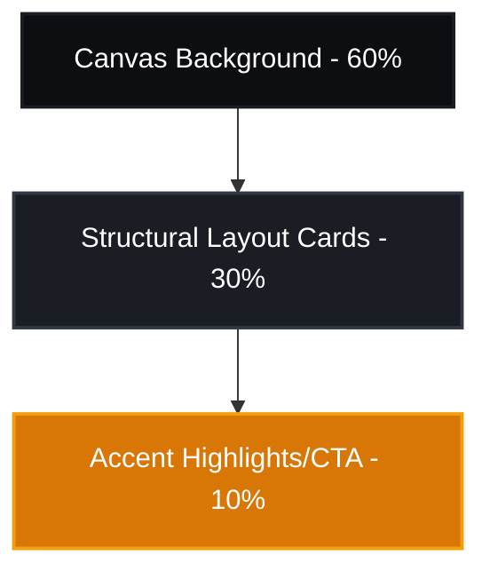

# Design Principles for Dynamic Visual Generation

This document outlines the core visual design principles for the `lz-visual-forge` engine. It defines the standards for layout composition, visual hierarchy, spacing, alignment, and modern aesthetic execution within the technical constraints of Vercel Satori's SVG rendering pipeline.

---

## 1. Core Visual Philosophy

To deliver production-grade, premium designs and avoid the "AI-generated slop" aesthetic, all templates generated by Visual Forge must adhere to four core tenets:

1. **Geometric Rigor**: Every element must align to a strict structural grid. Offsets and asymmetry must be highly intentional and mathematically balanced.
2. **Intentional Negativity (Whitespace)**: Give elements breathing room. Premium design is defined by what you omit. Negative space acts as a visual buffer, reducing cognitive load and directing the user's focus.
3. **Contrast as Hierarchy**: Establish a clear reading sequence using size, weight, and color value. The eye must immediately know where to land, where to scan, and where to rest.
4. **Haptic Depth**: Simulating tactile qualities (glassmorphism, subtle micro-borders, layered shadows) makes digital graphics feel premium and physical.

---

## 2. Spacing Rules & The 8pt Grid

All layout dimensions, paddings, margins, and component heights must align to a strict **8-point grid system** (e.g., 8px, 16px, 24px, 32px, 48px, 64px, 80px, 96px, 128px).

### The Spacing Scale
| Name | Value | Use Case |
| :--- | :--- | :--- |
| `space-1` | **4px** | Micro-adjustments, badge padding, border-to-text offsets |
| `space-2` | **8px** | Inline gap between icon and text, tag/badge internal padding |
| `space-3` | **12px** | Compact list spacing, tight structural gutters |
| `space-4` | **16px** | Standard grid gutter, sub-element padding, card vertical gaps |
| `space-6` | **24px** | Mid-size section padding, standard card margins |
| `space-8` | **32px** | Major block transitions, large card padding |
| `space-12` | **48px** | Canvas margins for micro-formats (e.g., 1080x1080) |
| `space-16` | **64px** | Standard canvas safety margin, major visual divisions |
| `space-20` | **80px** | Large canvas safety margin (e.g., 1600x900 / 1200x1350) |

> [!IMPORTANT]
> Never use arbitrary spacing values (e.g., `17px` or `33px`). Every single dimension must be a factor of the 8pt grid scale. For Satori, layout adjustments are processed via Yoga's flexbox engine, making precise margins and padding critical to prevent line wraps and overflow.

---

## 3. Structural Grid & Alignment

A premium composition avoids centering every single element on the canvas. Instead, apply structured layout grids.

### The Left-Heavy Rule (F-Pattern)
For technical and informational graphics, align primary headings and body copy to a shared **left axis**. The human eye scans in an F-pattern (Left-to-Right, Top-to-Bottom). 
- Do not center-align blocks containing more than two lines of text.
- Maintain a minimum of `space-16` (64px) left padding as a global margin.

### The Symmetric Anchor (Z-Pattern)
For display cards, promos, and quotes, center-alignment is acceptable only if the elements are strictly stacked and anchored by a strong top-level tag and bottom-level logo.

```
[ Top-Left: Metadata/Tag ] ───────────────────────── [ Top-Right: Brand Mark ]
                                   │
                                   │ (Diagonal Scan)
                                   ▼
[ Centered / Left-Aligned Main Message: 36px - 64px Display Font ]
                                   │
                                   ▼
[ Bottom-Left: Author/Metadata ] ─────────────────── [ Bottom-Right: Call-to-Action ]
```

---

## 4. Visual Rhythm & Focal Points

A layout without hierarchy is visual noise. Visual Forge uses a strict **60-30-10 composition ratio** for visual weight:
- **60% Dominant Base**: The background structure, solid canvas, or overall color base.
- **30% Structural Content**: Cards, dividers, text blocks, and secondary shapes.
- **10% Accent Highlighting**: Call-to-action badges, gradient borders, focal icons, or key metric numbers.



### Contrast Scaling
Establish reading hierarchy through extreme size differentials. If your header is 48px, your subtitle should not be 36px. Instead:
- **Primary Header**: 56px (Bold, high contrast)
- **Secondary Descriptor**: 20px (Regular/Medium, muted gray)
- **Metadata Tag**: 12px (Uppercase, tracked out, accent color)

---

## 5. Haptic Aesthetics & Visual Depth

To make digital cards look physical, we simulate depth using modern UI paradigms compatible with Satori.

### Subtle Micro-Borders
Instead of flat edges, wrap container elements in thin, semi-transparent borders.
- **Dark Mode**: `border: 1px solid rgba(255, 255, 255, 0.08)`
- **Light Mode**: `border: 1px solid rgba(0, 0, 0, 0.06)`

### Glassmorphism / Acrylic Layers
Satori does not support CSS `backdrop-filter: blur()`. To simulate glass, use a layered rendering structure:
1. Define a solid background with radial gradients to establish color pools.
2. Overlay an absolute card container with a solid, high-transparency color and micro-borders:
   ```css
   background-color: rgba(26, 29, 36, 0.75);
   border: 1px solid rgba(255, 255, 255, 0.1);
   ```

### Simulating Shadows (The SVG Filter Workaround)
Since standard `box-shadow` is not supported reliably by Satori's Yoga engine, render drop shadows using inline SVG paths with a Gaussian blur filter:
```xml
<svg width="0" height="0">
  <filter id="shadow" x="-10%" y="-10%" width="120%" height="120%">
    <feDropShadow dx="0" dy="8" stdDeviation="12" flood-color="#000000" flood-opacity="0.3"/>
  </filter>
</svg>
```
Apply this ID to SVG wrappers to isolate visual depth layers.

---

## 6. Satori Optimization Checklist

When converting these design principles into code, remember Satori's layout characteristics:

> [!TIP]
> - **Flex Direction**: Satori defaults to `flex-direction: column`. Always state `flex-direction: row` explicitly if you want horizontal flows.
> - **No Overlap Flow**: Elements in standard flow will never overlap. If you need layered effects (such as background shapes, floating badges, or decorative gradients), wrap the content in a flex container and use `position: absolute` with explicit offsets.
> - **Explicit Dimensions**: Satori's Yoga engine needs to calculate bounding boxes. Always define absolute `width` and `height` on the root container, and explicit dimensions on all loaded images.
