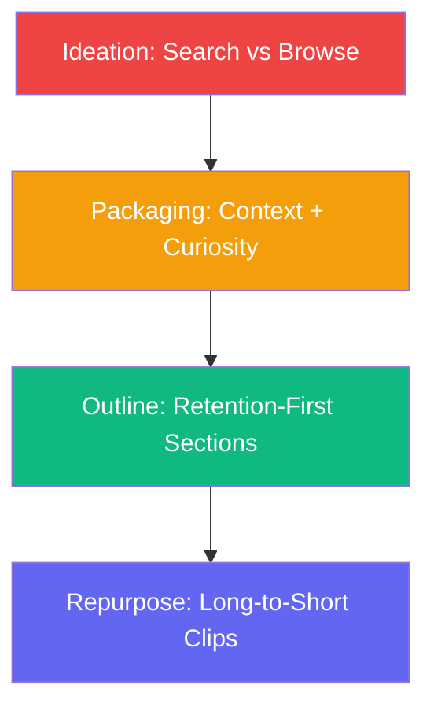

<div align="center">

# 🎥 lz-youtube-engine

**Unified YouTube Content Engine: Ideation, Packaging, Outlining, & Repurposing**

[](https://skills.sh)
[](https://opensource.org/licenses/MIT)

</div>

---

## Overview

A specialized, comprehensive skill for YouTube content creation. `lz-youtube-engine` integrates all phases of the long-form video pipeline: discovering viable ideas, packaging them with non-echoing titles and thumbnails, designing retention-focused outlines, and repurposing finished videos into short-form clips.

## How it Works



## Absorbed Skills

Consolidates 4 separate YouTube-related draft skills:
- **youtube-ideation** → `references/ideation-system.md`
- **youtube-packaging** → `references/packaging-system.md`
- **long-form-outline** → `references/long-form-structure.md`
- **long-to-short** → `references/long-to-short-repurpose.md`

## The Research

| Source | Concept | Application |
|---|---|---|
| YouTube Discovery Engine Guide | Search vs. Browse Optimization | Separating evergreen search topics from momentum-driven browse plays |
| Creator Packaging Principle | Non-Echoing Title & Thumbnail | Title targets keywords/SEO; Thumbnail creates visual curiosity. No word overlap. |
| Retention Editing & Scripting | Section-Level Payoffs | Cutting out sag points, designing climax-led cold opens |

## Install

```bash
npx skills add lutfi-zain/lz-stacks --skill lz-youtube-engine
```
